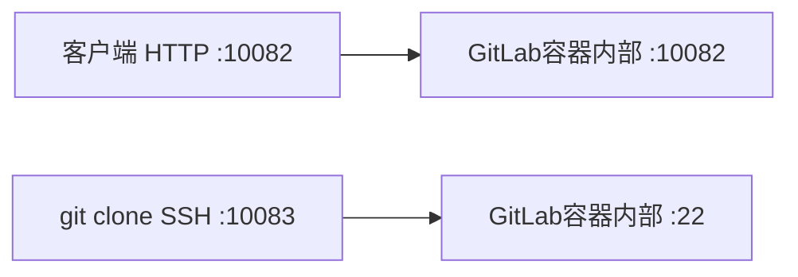
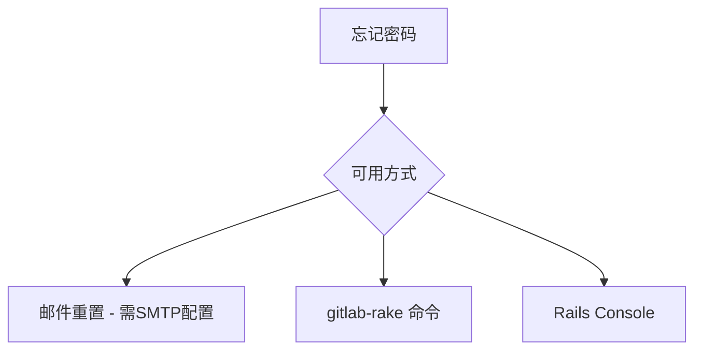

# GitLab的Docker安装部署

## 概述

GitLab 是企业级 Git 服务的事实标准，本文详解基于 Docker Compose 的 GitLab CE 部署全流程，涵盖配置模板解析、端口映射规则、CPU 架构适配、数据持久化策略、初始化登录及密码重置等关键环节，帮助你在生产环境中快速搭建稳定可靠的 GitLab 实例。

## 前置知识

- Docker 与 Docker Compose 基础（参见 Docker入门）
- 开源 Git 服务选型认知（参见 13-开源Git服务对比与选型）
- Linux 服务器基本操作（参见 Linux基础）

## 学习目标

- 掌握 GitLab Docker Compose 配置模板及各关键参数含义
- 理解端口映射的"三端口一致"原则
- 能够根据 CPU 架构选择正确镜像
- 完成从部署到首次登录的全流程操作
- 掌握密码重置的三种方法

---

## 一、安装方式概览

GitLab 官方支持四种安装方式：

| 方式 | 适用场景 | 复杂度 |
|------|----------|:------:|
| **Linux Package** | 生产环境（推荐） | 中 |
| **Helm Chart** | Kubernetes 集群 | 高 |
| **Operator** | Kubernetes Operator 管理 | 高 |
| **Docker / Docker Compose** | 学习测试、中小团队 | 低 |

> 本文聚焦 Docker Compose 方式，兼顾学习便捷性与生产可用性。

---

## 二、Docker Compose 配置详解

### 2.1 完整配置模板

```yaml
# docker-compose.yml - GitLab CE 生产配置

services:
  web:
    image: 'gitlab/gitlab-ce:16.3.0-ce.0'
    container_name: gitlab
    restart: always
    hostname: '192.168.1.100'
    environment:
      GITLAB_OMNIBUS_CONFIG: |
        external_url 'http://192.168.1.100:10082'
        gitlab_rails['gitlab_shell_ssh_port'] = 10083
        # SMTP 邮件配置（可选）
        # gitlab_rails['smtp_enable'] = true
        # gitlab_rails['smtp_address'] = "smtp.example.com"
        # gitlab_rails['smtp_port'] = 465
        # gitlab_rails['smtp_user_name'] = "user@example.com"
        # gitlab_rails['smtp_password'] = "password"
        # gitlab_rails['smtp_tls'] = true
    ports:
      - '10082:10082'   # HTTP
      - '10083:22'      # SSH
    volumes:
      - '$GITLAB_HOME/config:/etc/gitlab'
      - '$GITLAB_HOME/logs:/var/log/gitlab'
      - '$GITLAB_HOME/data:/var/opt/gitlab'
    shm_size: '512m'
```

### 2.2 关键配置项解析

| 配置项 | 说明 | 注意事项 |
|--------|------|----------|
| `image` | 镜像及版本，`ce` = 社区版，`ee` = 企业版 | 根据 CPU 架构选择 |
| `hostname` | 有域名用域名，无域名用服务器 IP | 不能用 localhost |
| `external_url` | 外部访问地址，格式 `http(s)://地址:端口` | 端口需与 ports 映射一致 |
| `gitlab_shell_ssh_port` | SSH 克隆时显示的端口 | 需与 ports 中 SSH 映射对应 |
| `shm_size` | 共享内存大小 | 最低 256MB，建议 512MB |
| `volumes` | 数据持久化映射 | 必须设置，否则数据随容器丢失 |

### 2.3 端口映射规则



**三端口一致原则：**

- `external_url` 中的端口
- `ports` 映射的宿主机端口
- 容器内部监听端口

三者保持对应关系，避免配置错乱导致访问失败。

---

## 三、CPU架构与镜像选择

### 3.1 确认系统架构

```bash
uname -m
# x86_64   → Intel/AMD 64位（常见服务器）
# aarch64  → ARM 64位（Apple Silicon、ARM服务器）
```

### 3.2 镜像选择

| CPU架构 | 镜像标签 | 说明 |
|---------|----------|------|
| x86_64 | `gitlab/gitlab-ce:16.3.0-ce.0` | 官方默认支持 |
| ARM64 | `gitlab/gitlab-ce:16.3.0-ce.0` | 16.3+ 官方已支持 |
| ARM64（旧版本） | `yrzr/gitlab-ce-arm64` | 第三方镜像 |

> GitLab 16.3+ 官方镜像已原生支持 ARM64 架构，无需第三方镜像。

---

## 四、环境变量与数据持久化

### 4.1 设置环境变量

```bash
# 创建 GitLab 目录
mkdir -p ~/gitlab && cd ~/gitlab

# 创建 .env 文件
cat > .env << 'EOF'
GITLAB_HOME=/home/gitlab
EOF
```

### 4.2 数据卷映射关系

| 宿主机路径 | 容器内路径 | 用途 |
|------------|-----------|------|
| `$GITLAB_HOME/config` | `/etc/gitlab` | 配置文件（gitlab.rb） |
| `$GITLAB_HOME/logs` | `/var/log/gitlab` | 日志文件 |
| `$GITLAB_HOME/data` | `/var/opt/gitlab` | 数据（仓库、数据库、缓存） |

数据持久化的核心价值：
- 删除/重建容器后数据不丢失
- 便于备份和跨服务器迁移
- 配置修改后重启即生效

---

## 五、部署完整流程

### 5.1 服务器准备

```bash
# 检查系统资源（最低要求：2核4G + 2GB Swap）
free -h          # 查看内存
nproc            # 查看CPU核心数
df -h            # 查看磁盘空间

# 验证 Docker 环境
docker --version
docker compose version
```


### 5.2 启动与监控

```bash
# 启动容器
docker compose up -d

# 实时查看启动日志
docker logs -f gitlab

# 查看容器状态
docker ps | grep gitlab
```

### 5.3 启动过程要点

| 阶段 | 预期表现 | 处理方式 |
|------|----------|----------|
| 首次启动 | 耗时 3-5 分钟 | 耐心等待，不要中断 |
| 502 Bad Gateway | 正常现象，服务初始化中 | 查看日志确认进度 |
| `gitlab Reconfigured!` | 启动成功标志 | 可访问 Web 界面 |
| Permission denied | 权限问题 | 检查数据卷目录权限 |
| No space left | 磁盘不足 | 清理空间或扩容 |

---

## 六、初始化登录配置

### 6.1 获取初始密码

```bash
# 方式一：容器命令获取（推荐）
docker exec -it gitlab grep 'Password:' /etc/gitlab/initial_root_password

# 方式二：查看密码文件
cat $GITLAB_HOME/config/initial_root_password
```

> 初始密码文件会在 **24小时后自动删除**，务必及时修改密码。

### 6.2 首次登录流程

1. 浏览器访问 `http://服务器IP:10082`
2. 用户名：`root`，密码：从上述文件获取
3. 设置中文界面：右上角头像 → Preferences → Language → 简体中文
4. 修改密码：用户设置 → 密码 → 输入新密码

---

## 七、密码重置方法

### 7.1 三种重置方式



**方式一：gitlab-rake 命令（推荐）**

```bash
docker exec -it gitlab gitlab-rake "gitlab:password:reset"
# 按提示输入用户名、新密码、确认密码
```

**方式二：Rails Console（完全控制）**

```bash
docker exec -it gitlab gitlab-rails console

# 在 Console 中执行
user = User.find_by(username: 'root')
user.password = '新密码'
user.password_confirmation = '新密码'
user.save!
```

**方式三：邮件重置**

需提前配置 SMTP，通过 `http://地址/users/password/new` 发送重置链接。

---

## 常见问题

| 问题 | 原因 | 解决方案 |
|------|------|----------|
| 容器启动后立即退出 | 共享内存不足 | 设置 `shm_size: '512m'` |
| 502 Bad Gateway 持续 | GitLab 还在启动中 | 等待 3-5 分钟，查看日志 |
| 无法访问 Web 界面 | 端口映射错误 | 检查 external_url 和 ports 配置 |
| SSH 克隆失败 | SSH 端口配置错误 | 确认 `gitlab_shell_ssh_port` 与映射一致 |
| 内存不足频繁崩溃 | 服务器内存太小 | 增加内存或添加 Swap 分区 |
| 初始密码文件不存在 | 已超过 24 小时 | 使用 `gitlab-rake` 重置密码 |
| 权限错误 | 数据卷权限问题 | 确保目录属主和权限正确 |

## 最佳实践

1. **镜像版本锁定**：生产环境使用具体版本号（如 `16.3.0-ce.0`），避免 `latest`
2. **共享内存必设**：`shm_size` 最低 256MB，4GB+ 内存服务器建议 512MB
3. **数据持久化三件套**：config / logs / data 缺一不可
4. **部署检查清单**：
   - CPU ≥ 2核，内存 ≥ 4GB（推荐 8GB），磁盘 ≥ 20GB
   - `uname -m` 确认架构
   - `.env` 和 `docker-compose.yml` 配置正确
   - hostname 已修改为实际 IP/域名
   - 端口映射三处对应
5. **首次登录后立即**：修改 root 密码 → 禁用公开注册 → 配置 SMTP

## 延伸阅读

- [GitLab Docker 安装文档](https://docs.gitlab.com/ee/install/docker.html)
- [GitLab 系统要求](https://docs.gitlab.com/ee/install/requirements.html)
- [GitLab 密码重置文档](https://docs.gitlab.com/ee/security/reset_user_password.html)

---


