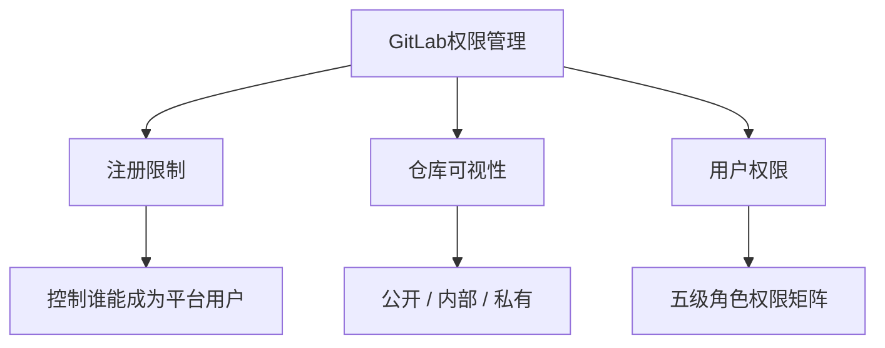
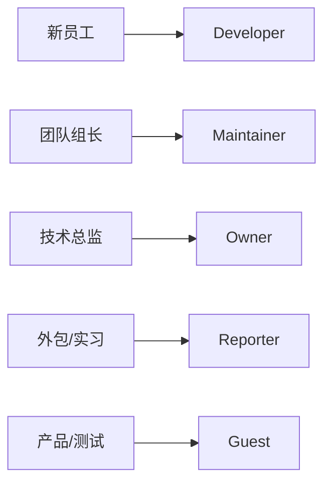
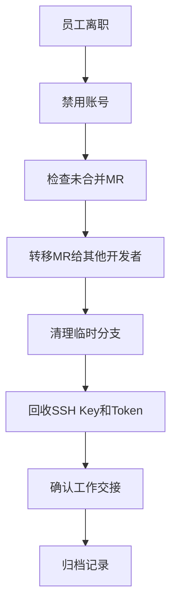
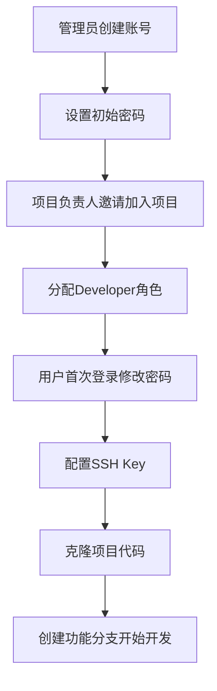

# GitLab平台使用与权限管理

## 概述

GitLab 的权限体系是企业级代码协作的安全基石。本文系统讲解 GitLab 权限管理的三大维度（注册限制、仓库可视性、用户权限），深入解析五级角色权限矩阵、保护分支配置策略、用户离职处理流程，并提供新员工入职到日常运维的完整权限管理实践。

## 前置知识

- GitLab Docker 部署完成（参见 14-GitLab的Docker安装部署）
- Git 分支管理基础（参见 09-子模块与多仓库）
- Git 仓库权限管理概念（参见 12-安全与审计）

## 学习目标

- 掌握 GitLab 权限管理三大维度的配置方法
- 理解五级角色（Guest → Owner）的权限边界
- 能够设计合理的保护分支策略
- 掌握用户离职的安全处理流程
- 建立完整的权限管理检查清单

---

## 一、权限体系三大维度



| 维度 | 控制范围 | 管理层级 |
|------|----------|----------|
| **注册限制** | 谁能注册成为平台用户 | 平台级（管理员） |
| **仓库可视性** | 仓库的可见范围 | 项目级（Owner） |
| **用户权限** | 用户对仓库的具体操作权限 | 项目级（Maintainer+） |

---

## 二、注册限制配置

### 2.1 配置路径

```
管理中心 → 设置 → 通用 → 注册限制
```

### 2.2 配置项说明

| 配置项 | 效果 | 推荐 |
|--------|------|------|
| 已启用注册功能 | 关闭后页面不显示注册按钮 | 企业内网：关闭 |
| 新注册需管理员批准 | 用户注册后需审核 | 外包团队：开启 |
| 注册邮箱域名白名单 | 仅允许指定域名邮箱注册 | 开放注册：`@company.com` |
| 注册邮箱域名黑名单 | 禁止特定域名注册 | 按需配置 |

### 2.3 企业级配置建议

| 场景 | 配置策略 | 说明 |
|------|----------|------|
| **内网部署** | 完全禁用注册 | 所有账号由管理员创建 |
| **开放注册** | 开启邮箱白名单 | 仅允许公司邮箱 |
| **外包团队** | 需管理员批准 | 审核后加入，设置到期日 |

---

## 三、用户管理

### 3.1 创建用户

```
管理中心 → 用户 → 新用户
```

填写信息：姓名、用户名（登录用）、邮箱、访问类型（普通/管理员）。

> 初次创建时不能直接设置密码，需创建后进入用户编辑页面单独设置。

### 3.2 用户类型

| 用户类型 | 权限范围 | 适用场景 |
|----------|----------|----------|
| **普通用户** | 参与项目开发，无管理权限 | 开发者、测试人员 |
| **管理员** | 平台所有权限，可管理用户和配置 | 运维、技术主管 |
| **外部用户** | 仅限被授权的项目 | 外包人员、合作方 |

### 3.3 批量用户管理（高级）

```bash
# 进入 GitLab Rails Console
docker exec -it gitlab gitlab-rails console

# 批量创建用户
users = [
  { name: '张三', username: 'zhangsan', email: 'zhangsan@company.com' },
  { name: '李四', username: 'lisi', email: 'lisi@company.com' }
]

users.each do |u|
  user = User.new(
    name: u[:name],
    username: u[:username],
    email: u[:email],
    password: 'InitialPassword123!',
    password_confirmation: 'InitialPassword123!',
    skip_confirmation: true
  )
  user.save!
  puts "Created user: #{u[:username]}"
end
```

---

## 四、项目角色权限矩阵

### 4.1 五级角色详解

| 角色 | 核心权限 | 限制 |
|------|----------|------|
| **Guest（访客）** | 查看项目、创建 Issue | 不能访问代码 |
| **Reporter（报告者）** | + 拉取代码、评论 | 不能推送代码 |
| **Developer（开发者）** | + 推送到非保护分支、创建 MR | 不能合并到保护分支 |
| **Maintainer（维护者）** | + 推送保护分支、合并 MR、管理成员 | 不能删除/转移项目 |
| **Owner（所有者）** | + 删除项目、转移项目、完全控制 | — |

> 注：自 GitLab 17.2 起，官方角色体系中新增了 **Planner（规划者）** 角色，用于工单、里程碑等规划类工作，权限介于 Guest 与 Reporter 之间。

### 4.2 角色分配建议



### 4.3 邀请成员

```
项目 → 管理 → 成员 → 邀请成员
```

操作步骤：搜索用户名/邮箱 → 选择角色 → 设置到期日（可选）→ 点击邀请。

---

## 五、保护分支配置

### 5.1 保护分支的核心作用

- 防止误删除重要分支
- 禁止强制推送（force push）
- 限制直接推送，强制通过 MR 合并
- 要求代码审查（Code Review）
- 可要求 CI/CD 通过后才能合并


### 5.2 配置路径

```
项目 → 设置 → 仓库 → 受保护的分支
```

### 5.3 规则配置

| 配置项 | 选项 | 说明 |
|--------|------|------|
| **分支名称** | 固定名 / 通配符 | 如 `main`、`feature-*`、`release/*` |
| **允许合并** | No one / Developers+Maintainers / Maintainers | 控制谁能合并代码 |
| **允许推送** | No one / Developers+Maintainers / Maintainers | 控制谁能直接推送 |
| **不允许强制推送** | 勾选 | 推荐始终开启 |
| **不允许删除** | 勾选 | 推荐始终开启 |

### 5.4 通配符规则示例

| 规则 | 匹配 | 不匹配 |
|------|------|--------|
| `feature-*` | feature-login、feature-user-auth | feature（无横杠） |
| `release/*` | release/v1.0、release/v2.0-beta | release-v1.0 |
| `*-release` | v1.0-release、hotfix-release | release-v1.0 |

### 5.5 推荐保护策略

| 分支类型 | 允许推送 | 允许合并 | 强制推送 |
|----------|----------|----------|:--------:|
| **main / master** | No one | Maintainers | 禁止 |
| **develop** | Developers + Maintainers | Maintainers | 禁止 |
| **feature-\*** | Developers + Maintainers | Developers + Maintainers | 禁止 |
| **release-\*** | Maintainers | Maintainers | 禁止 |
| **hotfix-\*** | Maintainers | Maintainers | 禁止 |

---

## 六、用户离职处理

### 6.1 用户状态对比

| 状态 | 效果 | 适用场景 |
|------|------|----------|
| **活跃** | 正常使用 | 在职员工 |
| **禁用（Deactivate）** | 无法登录，保留成员关系和历史提交 | 正常离职（推荐） |
| **冻结（Block）** | 无法登录，成员关系保留但被阻止访问 | 长期离职/违规 |
| **封禁（Ban）** | 无法登录且被拒绝访问项目 | 恶意攻击 |
| **删除（Delete）** | 彻底删除，历史提交变为匿名 | 不推荐 |

### 6.2 离职处理标准流程



### 6.3 批量禁用操作

```bash
docker exec -it gitlab gitlab-rails console

# 批量禁用离职用户
users_to_deactivate = ['user1', 'user2', 'user3']
users_to_deactivate.each do |username|
  user = User.find_by(username: username)
  if user
    user.deactivate!
    puts "Deactivated: #{username}"
  end
end
```

---

## 七、新员工入职流程



---

## 常见问题

| 问题 | 原因 | 解决方案 |
|------|------|----------|
| 无法推送代码到 main | 分支受保护 | 创建 feature 分支，通过 MR 合并 |
| 用户无法登录 | 账号被禁用/冻结 | 管理中心重新激活 |
| MR 无法合并 | 需审批 / CI 未通过 | 等待审批或修复 CI |
| 强制推送失败 | 保护分支禁止 | 联系 Maintainer 处理 |
| 找不到项目 | 无访问权限 | 联系项目管理员添加成员 |
| 历史提交变成匿名 | 用户被删除 | 应使用禁用而非删除 |

## 最佳实践

1. **注册管控**：企业内网部署必须禁用公开注册，账号由管理员统一创建
2. **最小权限原则**：开发者选 Developer，组长选 Maintainer，避免过度授权
3. **保护分支分层**：main 最严格（No one 推送），feature 适当放宽
4. **通配符批量保护**：使用 `feature-*` 模式一次性保护同类型分支
5. **离职用禁用不用删除**：保留历史提交记录的完整性
6. **定期审查**：每季度检查成员权限、过期 Token、闲置账号

## 延伸阅读

- [GitLab 权限文档](https://docs.gitlab.com/ee/user/permissions.html)
- [保护分支文档](https://docs.gitlab.com/ee/user/project/protected_branches.html)
- [用户个人设置文档](https://docs.gitlab.com/ee/user/profile/)

---


