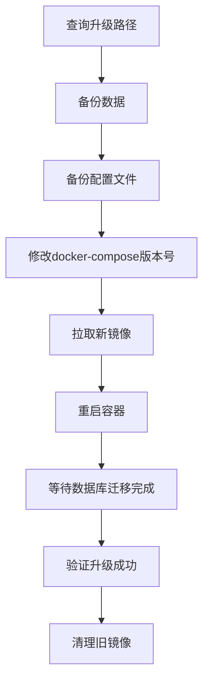
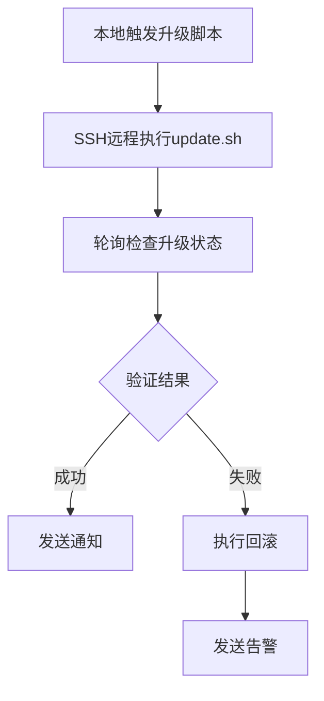

# GitLab版本升级与自动化脚本

## 概述

GitLab 升级是生产环境运维的高风险操作，必须严格遵循官方升级路径，不可跨版本跳跃。本文详解语义化版本号体系、升级路径规划器的使用方法、完整的手动升级流程，并提供生产级自动化升级脚本和验证脚本，确保升级过程安全可控、可回滚。

## 前置知识

- GitLab Docker 部署完成（参见 14-GitLab的Docker安装部署）
- Shell 脚本基础
- Docker Compose 基本操作

## 学习目标

- 理解 GitLab 升级不能跳版本的底层原因
- 掌握官方升级路径规划器的使用方法
- 能够执行完整的手动升级流程（备份→修改→拉取→重启→验证）
- 编写并运用自动化升级脚本
- 制定升级回滚预案

---

## 一、升级核心原则

### 1.1 为什么不能直接跳版本

GitLab 每次版本升级涉及**数据库迁移（Database Migration）**，新版本可能修改数据库结构。跨大版本升级时，中间版本的迁移脚本必须按顺序执行，否则会导致：

- 数据库结构不一致
- 数据丢失或损坏
- 服务无法启动

### 1.2 语义化版本号

```
版本号格式：MAJOR.MINOR.PATCH（如 16.3.0）
```

| 版本段 | 含义 | 升级规则 |
|--------|------|----------|
| **MAJOR**（主版本） | 重大变更，可能不兼容 | 必须按路径升级 |
| **MINOR**（次版本） | 新增功能，需数据库迁移 | 需按路径升级 |
| **PATCH**（补丁） | Bug 修复 | 通常可直接升级 |

**示例：**
- `16.3.0 → 16.3.1`：补丁升级，可直接执行
- `15.0.0 → 16.0.0`：跨主版本，必须按路径
- `15.0.5 → 15.1.6`：次版本变化，需按路径

---

## 二、官方升级路径查询

### 2.1 升级路径规划器

**在线工具地址：** https://gitlab-com.gitlab.io/support/toolbox/upgrade-path/

**使用步骤：**

1. 输入当前版本（Source version）
2. 选择版本类型（CE / EE）
3. 选择部署方式（Docker / Linux Package）
4. 点击 "Go" 生成升级路径

**输出示例：**

```
15.0.5 → 15.1.6 → 15.4.0 → 15.11.0 → 16.0.0
```

> 必须按顺序逐个升级，不能跳过中间版本。每次升级耗时约 5-15 分钟（取决于服务器配置）。

### 2.2 官方文档

- 升级路径文档：`docs.gitlab.com/update/`
- 升级路径规划器：`gitlab-com.gitlab.io/support/toolbox/upgrade-path/`

---

## 三、手动升级完整流程

### 3.1 流程图



### 3.2 备份操作

```bash
# 创建数据备份（容器内执行）
docker exec -t gitlab gitlab-backup create

# 备份文件位置：/var/opt/gitlab/backups/
# 命名格式：1681234567_2023_04_11_16.3.0_gitlab_backup.tar

# 备份配置文件（同样重要）
cp $GITLAB_HOME/config/gitlab.rb $GITLAB_HOME/config/gitlab.rb.backup
cp $GITLAB_HOME/config/gitlab-secrets.json $GITLAB_HOME/config/gitlab-secrets.json.backup
```

### 3.3 执行升级

```bash
# 1. 进入 GitLab 目录
cd ~/gitlab

# 2. 停止服务
docker compose down

# 3. 修改 docker-compose.yml 中的版本号
# 将 image: 'gitlab/gitlab-ce:15.0.5-ce.0'
# 改为 image: 'gitlab/gitlab-ce:15.1.6-ce.0'

# 4. 启动新版本
docker compose up -d

# 5. 监控升级日志
docker logs -f gitlab
# 看到 "gitlab Reconfigured!" 表示完成

# 6. 验证访问
# 浏览器访问 GitLab，确认正常

# 7. 清理旧镜像
docker image prune -f
```

### 3.4 按路径逐版本升级

```bash
# 从 15.0.5 升级到 16.0.0 的完整路径
./update.sh 15.1.6    # 第一步
./update.sh 15.4.0    # 第二步
./update.sh 15.11.0   # 第三步
./update.sh 16.0.0    # 第四步
```

---

## 四、自动化升级脚本


### 4.1 完整脚本

```bash
#!/bin/bash
# update.sh - GitLab 自动化升级脚本
set -e

# 颜色输出
RED='\033[0;31m'
GREEN='\033[0;32m'
YELLOW='\033[1;33m'
NC='\033[0m'

# 配置
COMPOSE_FILE="docker-compose.yml"
CONTAINER_NAME="gitlab"

info() { echo -e "${GREEN}[INFO]${NC} $1"; }
warn() { echo -e "${YELLOW}[WARN]${NC} $1"; }
error() { echo -e "${RED}[ERROR]${NC} $1"; }

# 验证版本参数
if [ -z "$1" ]; then
    error "请提供目标版本号"
    echo "用法: ./update.sh <版本号>"
    echo "示例: ./update.sh 15.1.6"
    exit 1
fi

NEW_VERSION=$1

# 获取当前版本号
info "正在获取当前版本号..."
OLD_VERSION=$(grep -oP 'gitlab/gitlab-ce:\K[0-9]+\.[0-9]+\.[0-9]+' $COMPOSE_FILE)

if [ -z "$OLD_VERSION" ]; then
    error "无法解析当前版本号"
    exit 1
fi

info "当前版本: $OLD_VERSION → 目标版本: $NEW_VERSION"

# 确认升级
read -p "确认升级? (y/n): " confirm
if [ "$confirm" != "y" ]; then
    warn "升级已取消"
    exit 0
fi

# 备份数据
info "正在备份 GitLab 数据..."
docker exec -t $CONTAINER_NAME gitlab-backup create STRATEGY=copy
if [ $? -ne 0 ]; then
    error "备份失败，升级终止"
    exit 1
fi
info "数据备份完成"

# 备份配置文件
BACKUP_DIR="./backup_$(date +%Y%m%d_%H%M%S)"
mkdir -p $BACKUP_DIR
cp $COMPOSE_FILE $BACKUP_DIR/
info "配置已备份到: $BACKUP_DIR"

# 替换版本号
sed -i "s/gitlab\/gitlab-ce:$OLD_VERSION/gitlab\/gitlab-ce:$NEW_VERSION/g" $COMPOSE_FILE
info "配置文件已更新"

# 执行升级
info "正在拉取新镜像并启动..."
docker compose pull
docker compose up -d

# 等待并监控
info "等待服务启动..."
sleep 10
if docker logs $CONTAINER_NAME 2>&1 | grep -q "gitlab Reconfigured!"; then
    info "升级成功！"
    docker image prune -f
    info "旧镜像已清理，请访问 Web 界面验证"
else
    error "升级可能失败，请检查日志"
    docker logs $CONTAINER_NAME --tail 100
    exit 1
fi
```

### 4.2 使用方法

```bash
chmod +x update.sh
./update.sh 15.1.6
```

---

## 五、升级验证

### 5.1 三种验证方式

```bash
# 方式一：Web 界面
# 浏览器访问 GitLab，能正常登录即成功

# 方式二：API 验证（/version 接口需要认证，需传入访问令牌）
curl -s -H "PRIVATE-TOKEN: <your-access-token>" http://localhost:10082/api/v4/version
# 返回：{"version":"15.1.6","revision":"xxxx"}

# 方式三：命令行验证
docker exec gitlab gitlab-rake gitlab:env:info
```

### 5.2 自动验证脚本

```bash
#!/bin/bash
# verify_upgrade.sh - 自动验证升级结果

GITLAB_URL="http://localhost:10082"
GITLAB_TOKEN=""   # GitLab 个人访问令牌，用于 API 查询版本
TIMEOUT=300
INTERVAL=10

echo "开始验证 GitLab 升级..."

elapsed=0
while [ $elapsed -lt $TIMEOUT ]; do
    # -L 跟随重定向：未登录访问首页会 302 跳转到登录页，登录页返回 200
    response=$(curl -s -L -o /dev/null -w "%{http_code}" $GITLAB_URL)

    if [ "$response" == "200" ]; then
        echo "GitLab 升级验证成功！"
        version=$(curl -s -H "PRIVATE-TOKEN: $GITLAB_TOKEN" $GITLAB_URL/api/v4/version | grep -o '"version":"[^"]*"')
        echo "当前版本: $version"
        exit 0
    fi
    
    echo "等待中... (HTTP $response, ${elapsed}s)"
    sleep $INTERVAL
    elapsed=$((elapsed + INTERVAL))
done

echo "验证超时，请检查日志"
exit 1
```

---


## 六、升级回滚方案

### 6.1 需要回滚的场景

- 升级后服务无法启动
- 数据库迁移失败
- 功能异常无法使用
- 性能严重下降

### 6.2 回滚步骤

```bash
# 1. 停止当前容器
docker compose down

# 2. 恢复配置文件
cp backup_YYYYMMDD_HHMMSS/docker-compose.yml ./

# 3. 恢复数据备份
docker exec -it gitlab gitlab-backup restore BACKUP=timestamp

# 4. 启动旧版本
docker compose up -d

# 5. 验证回滚成功
docker logs -f gitlab
```

### 6.3 回滚注意事项

| 约束 | 说明 |
|------|------|
| 只能回滚到备份时的版本 | 备份是回滚的前提 |
| 备份后的新数据会丢失 | 升级后产生的数据不可恢复 |
| 数据库向下迁移可能失败 | 高版本→低版本有风险 |
| 测试环境先验证 | 生产升级前在测试环境走一遍 |

---

## 七、运维自动化思路



**监控升级状态的关键命令：**

```bash
# 实时日志
docker logs -f gitlab

# 过滤错误
docker logs -f gitlab 2>&1 | grep -E "(error|Error|ERROR|failed)"

# 监控数据库迁移
docker logs -f gitlab 2>&1 | grep "migrating"
```

**升级过程状态判断：**

| 状态 | 含义 | 处理 |
|------|------|------|
| 502 Bad Gateway | 正常，正在启动/迁移 | 等待 5-10 分钟 |
| `gitlab Reconfigured!` | 升级成功 | 验证访问 |
| 持续报错 | 升级异常 | 检查日志，准备回滚 |

---

## 常见问题

| 问题 | 原因 | 解决方案 |
|------|------|----------|
| 502 错误持续很久 | 数据库迁移耗时 | 等待 5-10 分钟，查看日志 |
| 升级后无法启动 | 跳过了升级路径 | 按官方路径逐版本升级 |
| 数据库迁移失败 | 版本不兼容 | 恢复备份，重新按路径升级 |
| 配置丢失 | 未备份配置文件 | 升级前备份 config 目录 |
| 磁盘空间不足 | 备份文件占用 | 清理旧备份，扩大磁盘 |
| 内存不足 OOM | 升级过程内存消耗大 | 增加服务器内存或 Swap |

## 最佳实践

1. **永远遵循升级路径**：使用官方规划器查询，绝不跨版本升级
2. **升级前必备三件套**：`gitlab-backup create` + 备份 `gitlab.rb` + 备份 `gitlab-secrets.json`
3. **自动化脚本提效**：Shell 脚本封装备份→替换→拉取→重启→验证全流程
4. **测试环境先行**：生产升级前在测试环境完整走一遍
5. **准备回滚预案**：备份是回滚的唯一保障，升级前必须确认备份成功
6. **低峰期操作**：选择业务低峰期执行升级，提前通知团队

## 延伸阅读

- [GitLab 升级路径文档](https://docs.gitlab.com/update/)
- [升级路径规划器](https://gitlab-com.gitlab.io/support/toolbox/upgrade-path/)
- [备份恢复文档](https://docs.gitlab.com/ee/raketasks/backup_restore.html)
- [Docker 升级指南](https://docs.gitlab.com/ee/install/docker/upgrade.html)

---


