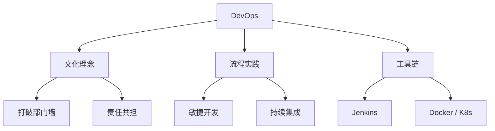
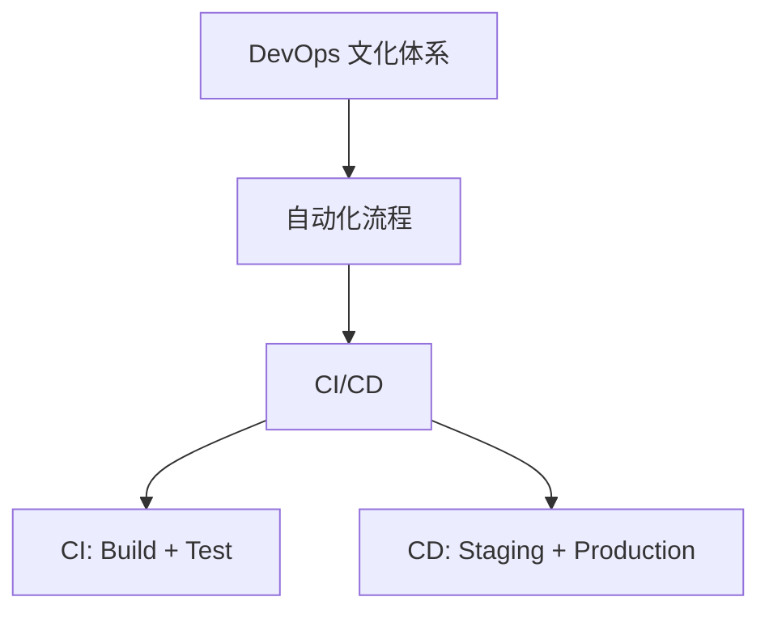
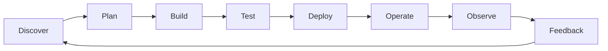

# DevOps 与自动化流程

## 概述

DevOps 是一套实践方法、工具链和文化理念的组合，旨在打破开发（Development）和运维（Operations）之间的壁垒，通过协作和自动化加速软件交付。本文详解 DevOps 三大支柱、生命周期八阶段及与 CI/CD 的层级关系。

## 学习目标

1. 理解 DevOps 的定义、三大支柱及发展历程
2. 掌握 Atlassian DevOps 生命周期 8 个阶段
3. 理清 DevOps、自动化、CI/CD 三者的包含关系

---

## 一、DevOps 核心概念

### 定义与目标

DevOps = Dev(Development) + Ops(Operations)，核心目标：

| 目标 | 说明 |
|------|------|
| 加速交付 | 缩短从开发到上线的周期 |
| 提高质量 | 通过自动化测试减少缺陷 |
| 提升效率 | 减少沟通成本，提高协作效率 |
| 增强可靠性 | 标准化流程，减少人为失误 |

### 三大支柱

| 支柱 | 内容 | 示例 |
|------|------|------|
| 文化理念 | 打破部门墙、责任共担 | 开发运维共同对系统负责 |
| 流程实践 | 敏捷开发、持续集成 | 每日站会、迭代开发 |
| 工具链 | 自动化工具集成 | Jenkins、Docker、K8s |

---

## 二、DevOps 与自动化的关系

| 维度 | DevOps | 自动化 | CI/CD |
|------|--------|--------|-------|
| 层级 | 文化体系 | 实践方法 | 具体环节 |
| 范围 | 全流程 | 构建到部署 | 集成与部署 |
| 重点 | 协作文化 | 工具应用 | 流程优化 |
| 包含关系 | 包含自动化 | 包含 CI/CD | DevOps 的子集 |

---

## 三、DevOps 生命周期（Atlassian 8 阶段）

### 阶段详解

| 阶段 | 职责 | 核心工具 |
|------|------|---------|
| Discover | 需求分析、优先级规划 | 用户反馈、市场调研 |
| Plan | 敏捷开发、任务分解 | Jira、Trello、禅道 |
| Build | 源代码管理、版本控制 | Git、GitLab、GitHub |
| Test | 自动化测试、质量保证 | Jest、Cypress、Playwright |
| Deploy | 自动化部署到生产环境 | Jenkins、ArgoCD |
| Operate | IT 服务交付、维护支持 | Kubernetes、Ansible |
| Observe | 识别并解决系统问题 | Prometheus、Grafana、ELK |
| Feedback | 评估版本、生成改进报告 | 数据分析、用户反馈 |

### Plan 阶段：敏捷开发

| 原则 | 说明 |
|------|------|
| 迭代开发 | 将工作分解为小的可交付增量 |
| 快速反馈 | 每个迭代完成后快速验证 |
| 持续改进 | 每次迭代后总结优化 |
| 小步快跑 | 更快实现功能，更低成本试错 |

敏捷 vs 瀑布：

| 维度 | 瀑布开发 | 敏捷开发 |
|------|---------|---------|
| 交付周期 | 数月甚至数年 | 1-4 周一个迭代 |
| 需求变更 | 难以变更 | 欢迎变更 |
| 客户参与 | 仅在开始和结束 | 持续参与 |
| 风险控制 | 后期才发现问题 | 早期发现问题 |

### Deploy 阶段：部署策略

| 策略 | 说明 | 风险 |
|------|------|------|
| 蓝绿部署 | 新旧版本并存，一键切换 | 低 |
| 金丝雀发布 | 先部署小部分用户，逐步扩大 | 低 |
| 滚动更新 | 逐步替换旧版本 | 中 |
| 直接替换 | 直接用新版本替换旧版本 | 高 |

### Observe 阶段：监控三要素

| 类型 | 说明 | 工具 |
|------|------|------|
| Metrics（指标） | CPU、内存、QPS、响应时间 | Prometheus、Grafana |
| Logs（日志） | 应用日志、错误日志 | ELK Stack、Loki |
| Traces（链路） | 分布式调用链路追踪 | Jaeger、Zipkin |

---

## 四、DevOps 工具链全景

| 阶段 | 核心工具 |
|------|---------|
| Plan | Jira、Trello、禅道 |
| Build | Git、GitLab、GitHub |
| Test | Jest、Vitest、Cypress |
| CI/CD | Jenkins、GitHub Actions、GitLab CI |
| Deploy | Docker、Kubernetes、ArgoCD |
| Operate | Kubernetes、Ansible |
| Observe | Prometheus、Grafana、ELK、Sentry |

---

## 常见问题

| 问题 | 解答 |
|------|------|
| DevOps 和敏捷开发有什么区别？ | DevOps 关注开发+运维协作，敏捷关注开发过程的迭代速度 |
| 必须用所有 DevOps 工具吗？ | 不需要，根据团队规模和需求选择合适的工具链 |
| 小团队适合实践 DevOps 吗？ | 适合，可以从简单的 CI/CD 流程开始 |
| 敏捷开发和瀑布开发如何选择？ | 需求明确选瀑布，需求变化选敏捷 |

---

## 最佳实践

1. 在团队中推动开发运维协作文化
2. 选择合适的 CI/CD 工具实践自动化
3. 建立完整的监控告警体系（Metrics + Logs + Traces）
4. 定期回顾和优化 DevOps 流程

---

## 延伸阅读

- [Atlassian DevOps 指南](https://www.atlassian.com/devops)
- [GitLab DevOps 平台](https://about.gitlab.com/topics/devops/)
- 《凤凰项目：一个运维工程师的逆袭》
- 《DevOps 实践指南》
- 《持续交付：发布可靠软件的系统方法》

> 📖 **相关理论延伸**：本文从 DevOps 文化视角俯瞰 CI/CD。CI/CD 概念全景与流水线设计见 [CI/CD](../01-持续交付与CI-CD/00-CI-CD.md)；GitHub Actions / GitLab CI / Jenkins 的工具化对比与选型见 [GitHub Actions 与 GitLab CI 对比](../01-持续交付与CI-CD/03-GitHub%20Actions%20与%20GitLab%20CI%20对比.md)；部署策略（蓝绿 / 金丝雀 / 滚动更新）的完整理论体系见《持续交付36讲》[部署策略：蓝绿、金丝雀、渐进式交付](../02-持续交付36讲/16-部署策略：蓝绿、金丝雀、渐进式交付.md)。

---

