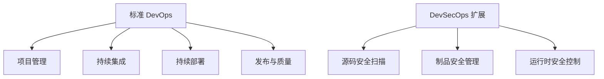
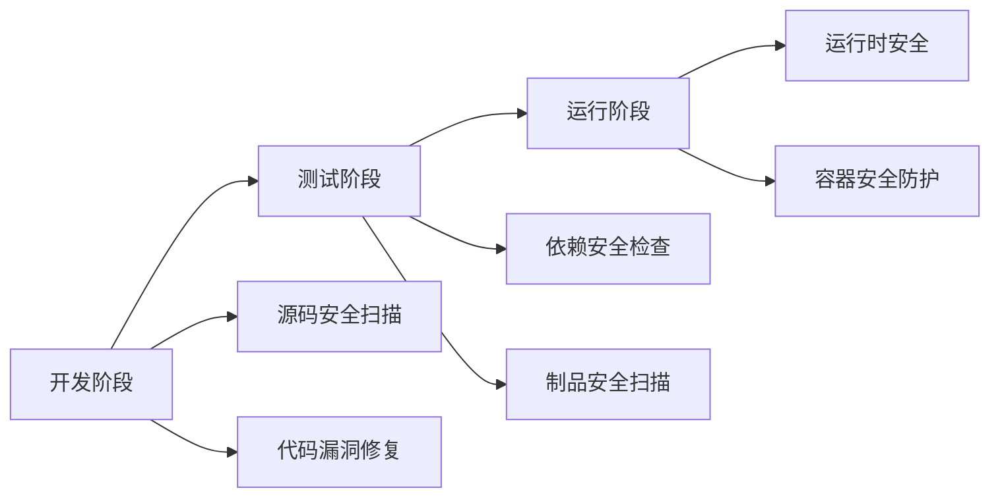

# DevOps 企业案例与工具链设计

## 概述

本文通过分析农业银行、腾讯等企业的 DevOps 实践案例，介绍 DevSecOps 安全扩展理念，并提供 DevOps 工具全景图与工具链设计方法论，帮助团队根据自身规模选择合适的工具组合。

## 学习目标

1. 了解企业级 DevOps 流程设计的特点与差异
2. 理解 DevSecOps 的安全实践流程
3. 掌握 DevOps 工具链设计步骤与选型决策

---

## 一、企业 DevOps 实践案例

### 案例一：农业银行（金融行业）

11 个环节的完整流程体系：

设计特点：
- 在标准 DevOps 基础上扩展了数据管理、事件管理、变更管理
- 针对金融行业的合规性和安全性要求进行定制
- 强调运营支撑，形成完整闭环

### 案例二：DevSecOps 扩展（安全导向）

DevOps vs DevSecOps：

| 维度 | DevOps | DevSecOps |
|------|--------|-----------|
| 关注点 | 开发运维协作 | 开发+运维+安全协作 |
| 安全定位 | 后期检查 | 全流程嵌入 |
| 安全测试 | 部署前测试 | 持续安全测试 |
| 漏洞处理 | 发现后修复 | 预防为主 |

### 案例三：腾讯（互联网企业）

| 环节 | 工具/平台 | 说明 |
|------|----------|------|
| 需求 | 敏捷研发、企业云盘 | 需求管理、文档协作 |
| 开发 | 代码检查、代码库 | 代码质量、版本控制 |
| 测试 | 测试系统 | 自动化测试平台 |
| 部署 | 作业平台、环境管理 | 部署自动化 |
| 监控 | 监控系统 | 性能监控、告警 |
| 运营 | 运营平台 | 数据分析、用户反馈 |

设计特点：覆盖全流程、工具自研+开源结合、内部工具平台化。

### 三大案例对比

| 案例 | 流程特点 | 适用场景 |
|------|---------|---------|
| 农业银行 | 11 环节，强调合规和运营 | 金融、国企、强监管行业 |
| DevSecOps | 标准流程 + 安全扩展 | 安全要求高的企业 |
| 腾讯 | 全流程覆盖，工具平台化 | 大型互联网企业 |

---

## 二、DevSecOps 安全实践

### 安全流程

### 安全工具推荐

| 安全类型 | 工具 | 说明 |
|---------|------|------|
| 源码安全扫描 | SonarQube、Checkmarx | 代码漏洞检测 |
| 依赖安全检查 | Snyk、npm audit | 第三方依赖漏洞 |
| 制品安全 | JFrog Xray、Clair | 制品漏洞扫描 |
| 容器安全 | Aqua Security、Trivy | 容器镜像安全 |
| 运行时安全 | Falco、Sysdig Secure | 运行时威胁检测 |

### 前端项目安全检查清单

| 检查项 | 工具/方法 | 频率 |
|--------|----------|------|
| 代码漏洞扫描 | SonarQube | 每次 commit |
| 依赖漏洞检查 | npm audit / Snyk | 每次 build |
| 敏感信息检查 | git-secrets | 每次 commit |
| CSP 配置 | 安全头配置 | 部署前 |
| HTTPS 强制 | SSL 证书检查 | 部署前 |

---

## 三、DevOps 工具全景图

### 协作管理

| 分类 | 工具 |
|------|------|
| 项目管理 | Jira、Trello、禅道、Teambition |
| 知识分享 | Confluence、语雀、飞书文档 |
| 沟通协作 | 钉钉、企业微信、Slack |

### 构建与版本控制

| 分类 | 工具 |
|------|------|
| 源码管理 | Git、GitLab、GitHub、Gitee |
| CI/CD | Jenkins、GitHub Actions、GitLab CI、CircleCI、Drone |
| 构建平台 | Maven、Gradle、npm/pnpm、Webpack/Vite |
| 制品管理 | Artifactory、Nexus、npm registry、Docker Registry |

### 测试工具

| 分类 | 工具 |
|------|------|
| 单元测试 | Jest、Vitest、Mocha |
| E2E 测试 | Cypress、Playwright、Selenium |
| 性能测试 | JMeter、k6、Locust |
| 代码覆盖率 | Istanbul、Codecov |

### 部署与运行

| 分类 | 工具 |
|------|------|
| 云平台 | AWS、Azure、阿里云、腾讯云、华为云 |
| 编排调度 | Kubernetes、Docker Swarm、Rancher、Helm |
| 监控日志 | Prometheus、Grafana、ELK、Sentry |
| 链路追踪 | Jaeger、Zipkin、SkyWalking |

---

## 四、工具链设计方法论

### 设计步骤

### 工具选择决策矩阵

| 团队规模 | CI/CD 工具 | 代码托管 | 部署方式 |
|---------|-----------|---------|---------|
| 小型（1-5 人） | GitHub Actions | GitHub | 云平台 |
| 中型（5-20 人） | GitLab CI / CircleCI | GitLab | 云平台 + K8s |
| 大型（20+ 人） | Jenkins | GitLab（自托管） | K8s 集群 |

### 前端项目推荐工具链

| 环节 | 推荐工具 | 理由 |
|------|---------|------|
| 代码托管 | GitLab / GitHub | 生态完善 |
| CI/CD | Jenkins / GitHub Actions | 灵活可控 |
| 构建 | Vite / Webpack | 前端主流 |
| 测试 | Jest + Cypress | 覆盖单元+E2E |
| 代码质量 | ESLint + SonarQube | 规范+质量门禁 |
| 制品管理 | npm registry（私有） | 内部包管理 |
| 部署 | Docker + K8s | 容器化部署 |
| 监控 | Sentry + Prometheus | 错误+性能监控 |

---

## 常见问题

| 问题 | 解答 |
|------|------|
| 工具这么多如何选择？ | 根据团队规模、技术栈、预算选择，不必追求大而全 |
| 小团队需要完整的 DevOps 吗？ | 可以从 CI/CD 开始，逐步完善其他环节 |
| DevSecOps 是必须的吗？ | 安全要求高的项目（金融、医疗）建议采用 |
| 如何说服团队采用 DevOps？ | 从效率提升、质量保障角度说明价值 |

---

## 延伸阅读

- [LEDGE DevOps 案例库](https://devops.ledge.ai/)
- [DevSecOps 实践指南](https://owasp.org/www-project-devsecops/)
- 《凤凰项目：一个运维工程师的逆袭》
- 《Site Reliability Engineering》（Google SRE）
- 《持续交付：发布可靠软件的系统方法》

---

