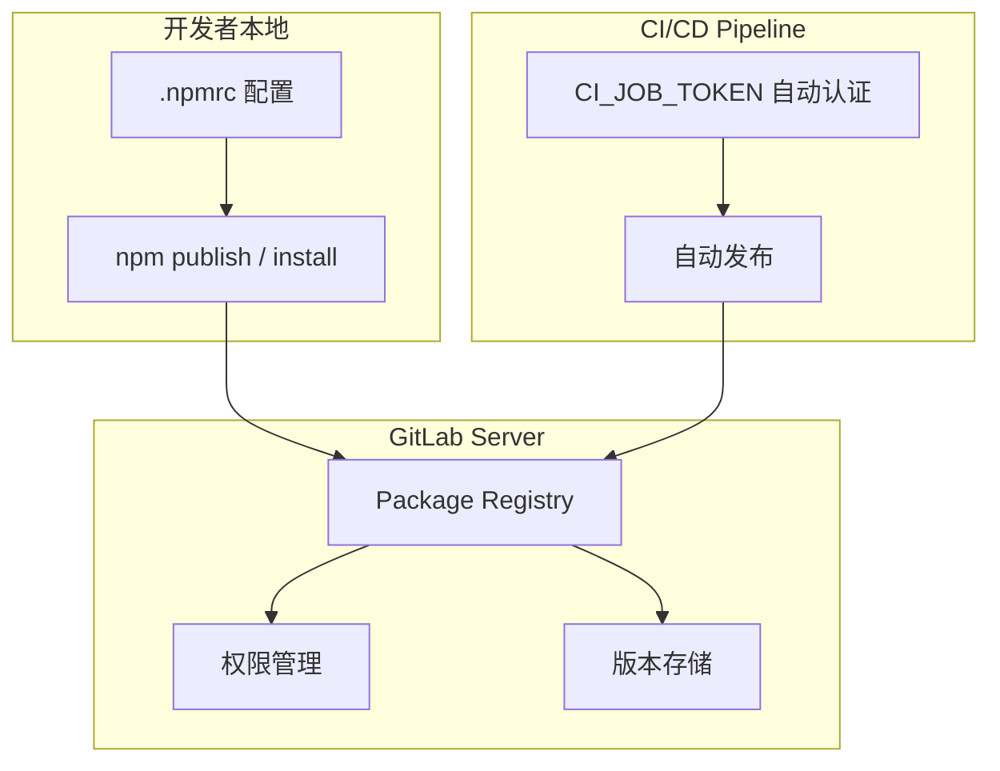
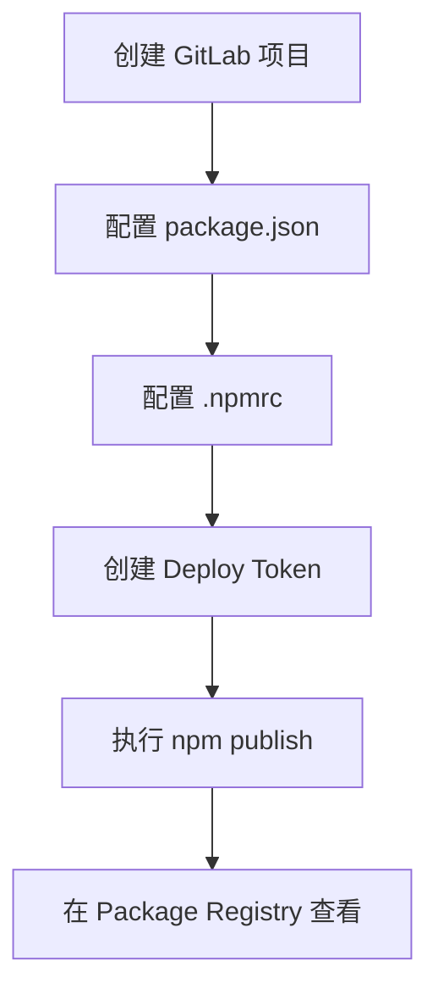
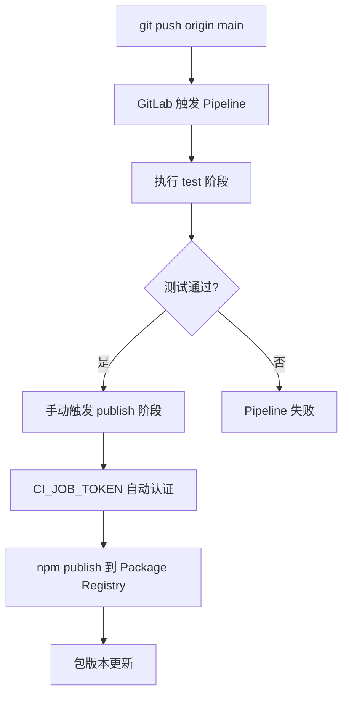

# GitLab Package Registry 使用

## 概述

GitLab Package Registry 是 GitLab 内置的制品管理功能，支持 NPM、Docker、Maven、NuGet 等多种包格式。对于使用 GitLab 的团队，它提供了与 CI/CD 深度集成的 NPM 私有包管理能力，无需额外部署 Verdaccio 等独立仓库。

## 学习目标

- 理解 GitLab Package Registry 的架构与适用场景
- 掌握 NPM 包发布流程（.npmrc 配置、Deploy Token、npm publish）
- 实现 CI/CD 自动化发布（CI_JOB_TOKEN）
- 理解 Token 权限管理与安全最佳实践

---

## 一、Package Registry 概述

### 1.1 支持的包格式

| 格式 | 适用场景 |
|------|---------|
| NPM Registry | 前端 JavaScript/TypeScript 包 |
| Docker Registry | 容器镜像 |
| Maven Repository | Java 包 |
| NuGet Repository | .NET 包 |
| PyPI Repository | Python 包 |

### 1.2 与 Verdaccio 的对比

| 对比项 | GitLab Package Registry | Verdaccio |
|--------|------------------------|-----------|
| 部署方式 | GitLab 内置，零部署 | 需独立部署和维护 |
| 认证机制 | GitLab Token 体系 | 独立用户名密码 |
| CI/CD 集成 | CI_JOB_TOKEN 自动认证 | 需手动配置 Token |
| 权限管理 | 继承 GitLab 项目权限 | 独立配置文件 |
| 适用团队 | 已使用 GitLab 的团队 | 独立部署或混合环境 |

### 1.3 架构模型



---

## 二、NPM 包发布流程

### 2.1 流程概览



### 2.2 配置 package.json

包名必须使用 `@scope/package-name` 格式，其中 scope 为 GitLab 用户名或组织名：

```json
{
  "name": "@my-org/ui-components",
  "version": "1.0.0",
  "description": "团队内部 UI 组件库",
  "main": "dist/index.js",
  "license": "MIT"
}
```

| Scope 类型 | 示例 | 适用场景 |
|-----------|------|---------|
| 用户名 | `@username/pkg-demo` | 个人项目 |
| 组织名 | `@my-org/ui-components` | 团队项目 |

### 2.3 配置 .npmrc

在项目根目录创建 `.npmrc` 文件：

```ini
# 指定 scope 对应的 registry 地址
@my-org:registry=http://gitlab.example.com/api/v4/projects/6/packages/npm/

# 配置认证 Token
//gitlab.example.com/api/v4/projects/6/packages/npm/:_authToken=${NPM_TOKEN}
```

配置说明：

| 配置项 | 作用 |
|--------|------|
| `@scope:registry` | 将该 scope 的包路由到指定 registry |
| `_authToken` | 认证令牌，用于读写权限验证 |

多 scope 配置示例：

```ini
@org-a:registry=http://gitlab.example.com/api/v4/projects/6/packages/npm/
//gitlab.example.com/api/v4/projects/6/packages/npm/:_authToken=token-a

@org-b:registry=http://gitlab.example.com/api/v4/projects/9/packages/npm/
//gitlab.example.com/api/v4/projects/9/packages/npm/:_authToken=token-b
```

### 2.4 创建 Deploy Token

路径：`项目 → 设置 → 仓库 → 部署令牌（Deploy Tokens）`

| 配置项 | 说明 |
|--------|------|
| 名称 | Token 标识，如 `pkg-publish-token` |
| 过期日期 | 可选，建议设置 |
| 权限 | `read_package_registry` / `write_package_registry` |

权限选择建议：

| 场景 | 推荐权限 |
|------|---------|
| 本地开发下载包 | 仅 `read_package_registry` |
| CI/CD 自动发布 | 使用 `CI_JOB_TOKEN`（无需手动创建） |
| 第三方工具集成 | 带过期时间的读写 Token |

> Token 创建后只显示一次，务必立即保存。

### 2.5 发布包

```bash
npm publish

# 输出示例
# + @my-org/ui-components@1.0.0
```

发布后在 `项目 → 部署 → 软件包库` 中查看已发布的包及版本。

---

## 三、下载 NPM 包

### 3.1 配置下载环境

在使用方的项目中配置 `.npmrc`（建议使用只读 Token）：

```ini
@my-org:registry=http://gitlab.example.com/api/v4/projects/6/packages/npm/
//gitlab.example.com/api/v4/projects/6/packages/npm/:_authToken=your-read-only-token
```


### 3.2 安装

```bash
npm install @my-org/ui-components
npm install @my-org/ui-components@1.0.0
npm install -D @my-org/ui-components
```

---

## 四、CI/CD 自动发布

### 4.1 为什么使用 CI/CD 发布

| 方式 | 安全性 | 便捷性 |
|------|--------|--------|
| 本地手动发布 | Token 存本地，有泄露风险 | 需手动执行 |
| CI/CD 自动发布 | CI_JOB_TOKEN 临时生成，更安全 | 推送代码自动触发 |

### 4.2 CI_JOB_TOKEN

GitLab CI/CD 自动注入的临时变量：

| 变量 | 说明 |
|------|------|
| `CI_JOB_TOKEN` | 当前 Job 的临时认证 Token |
| `CI_PROJECT_ID` | 项目 ID |
| `CI_SERVER_HOST` | GitLab 服务器地址 |

### 4.3 完整 CI/CD 配置

```yaml
# .gitlab-ci.yml

stages:
  - test
  - publish

# 测试阶段
test:
  stage: test
  image: node:22-alpine
  script:
    - npm ci --registry=https://registry.npmmirror.com
    - npm test

# 发布阶段
publish_npm:
  stage: publish
  image: node:22-alpine
  script:
    # 配置 registry
    - |
      npm config set @my-org:registry http://${CI_SERVER_HOST}/api/v4/projects/${CI_PROJECT_ID}/packages/npm/
    - |
      npm config set //${CI_SERVER_HOST}/api/v4/projects/${CI_PROJECT_ID}/packages/npm/:_authToken ${CI_JOB_TOKEN}
    # 发布
    - npm publish
  rules:
    - if: $CI_COMMIT_BRANCH == "main"
      when: manual
```

### 4.4 自动发布流程



---

## 五、安全最佳实践

### 5.1 Token 管理原则

| 原则 | 说明 |
|------|------|
| 最小权限 | 下载用只读 Token，发布用 CI_JOB_TOKEN |
| 设置过期 | 手动创建的 Token 必须设置过期时间 |
| 不提交 Token | .npmrc 中的 Token 使用环境变量引用 |
| 定期轮换 | 定期更换 Token，特别是人员变动时 |

### 5.2 .npmrc 安全配置

```ini
# 使用环境变量引用 Token，避免硬编码
@my-org:registry=http://gitlab.example.com/api/v4/projects/6/packages/npm/
//gitlab.example.com/api/v4/projects/6/packages/npm/:_authToken=${NPM_TOKEN}
```

将 `NPM_TOKEN` 配置在系统环境变量或 CI/CD 变量中，不要提交到版本库。

---

## 常见问题

**Q: 发布时报 403 Forbidden 怎么办？**

检查三点：1) Token 是否具有 `write_package_registry` 权限；2) 包名的 scope 是否与 .npmrc 中配置的 registry 匹配；3) 项目可见性设置是否允许当前用户写入。

**Q: CI_JOB_TOKEN 发布失败，提示权限不足？**

GitLab 15.x 后默认限制了 CI_JOB_TOKEN 的访问范围。需要在 `项目 → 设置 → CI/CD → Token Access` 中允许当前项目访问目标项目的 Package Registry。

**Q: 如何删除已发布的包版本？**

通过 GitLab API 删除：`DELETE /api/v4/projects/:id/packages/:package_id`。也可在 Package Registry 界面手动删除。注意已删除的版本号不能重复使用。

---

## 延伸阅读

- 官方文档：[GitLab Package Registry](https://docs.gitlab.com/ee/user/packages/)

