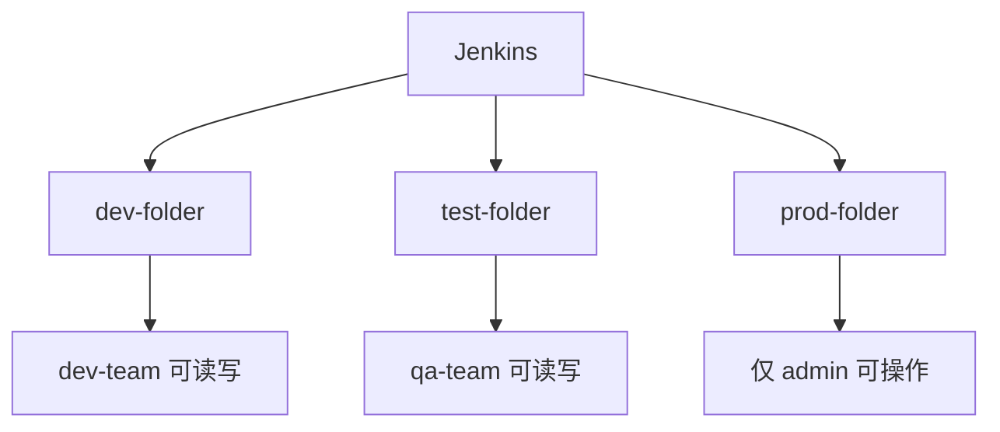

# Jenkins 权限控制配置

## 概述

Jenkins 权限控制是团队协作的基础，本文详解 Role-Based Strategy 角色权限体系的完整配置流程，包括全局角色、项目角色创建、角色分配及文件夹权限隔离。

## 学习目标

1. 理解 Jenkins 授权策略的四种模式
2. 掌握 Role-Based Strategy 的完整配置流程
3. 能够设计适合团队的角色权限方案

---

## 一、用户管理概述

### 用户类型

| 用户类型 | 说明 | 权限 |
|---------|------|------|
| admin | 管理员账户，初始安装时创建 | 完全控制 |
| Anonymous | 访客用户，未登录访问 | 可配置只读 |
| 认证用户 | 已登录的用户 | 根据角色分配 |

### 外部用户系统集成

| 安全域 | 说明 | 所需插件 |
|--------|------|---------|
| Jenkins 用户数据库 | 默认方式 | 无需 |
| GitLab | 使用 GitLab 账号登录 | GitLab Authentication |
| LDAP | 对接企业 LDAP | LDAP Plugin |
| GitHub | 使用 GitHub 账号登录 | GitHub OAuth |

---

## 二、授权策略对比

| 策略 | 说明 | 推荐场景 |
|------|------|---------|
| 任何人可以做任何事情 | 无权限控制 | 仅测试环境 |
| 安全矩阵 | 逐个用户配置权限 | 用户少的小团队 |
| 项目矩阵授权策略 | 项目级别配置权限 | 项目级权限控制 |
| Role-Based Strategy | 基于角色的权限控制 | 推荐大多数场景 |

### Role-Based Strategy 优势

- 灵活性高：任意角色 + 任意权限组合
- 易于管理：角色和用户分离，修改角色自动生效
- 支持正则匹配：用正则表达式匹配项目/文件夹
- 权限粒度细：全局、项目、视图、文件夹多层级

---

## 三、配置流程

### 步骤一：启用 Role-Based Strategy

```
系统管理 → 全局安全配置 → 授权策略 → Role-Based Strategy → 保存
```

### 步骤二：创建角色

路径：`系统管理 → Manage and Assign Roles → Manage Roles`

#### 全局角色（Global Roles）

| 角色名称 | 建议权限 |
|---------|---------|
| admin | 所有权限（Overall/Administer） |
| developer | Overall Read, Job Read/Create/Build, View Read |
| viewer | Overall Read, Job Read, View Read |

#### 项目角色（Item Roles）

| 角色名称 | Pattern | 权限 |
|---------|---------|------|
| dev-role | `dev.*` | Job Build/Read/Cancel |
| test-role | `test.*` | Job Read/Build |
| all-projects | `.*` | Job Read |

### Pattern 匹配规则

| Pattern | 匹配范围 |
|---------|---------|
| `test` | 精确匹配名为 "test" 的项目 |
| `test.*` | 匹配以 "test" 开头的所有项目 |
| `(?i)test.*` | 大小写不敏感匹配 |
| `dev/.*` | 匹配 dev 文件夹下的所有项目 |

### 步骤三：分配角色

路径：`系统管理 → Manage and Assign Roles → Assign Roles`

#### 全局角色分配

| User/Group | 角色 |
|------------|------|
| admin | admin |
| authenticated | developer |
| anonymous | viewer |

#### 项目角色分配

| User/Group | 角色 |
|------------|------|
| dev-team | dev-role |
| qa-team | test-role |

---

## 四、视图与文件夹

### 视图 vs 文件夹

| 特性 | 视图 | 文件夹 |
|------|------|--------|
| 本质 | 过滤器，筛选显示任务 | 独立命名空间 |
| 嵌套 | 不支持 | 支持子文件夹 |
| 同名任务 | 不允许 | 不同文件夹可同名 |
| 权限隔离 | 基于视图权限 | 基于文件夹权限 |

### 文件夹权限隔离



---

## 五、权限设计建议

### 小团队（5 人以下）

| 角色 | 人员 | 权限 |
|------|------|------|
| admin | 技术负责人 | 全部 |
| developer | 所有开发 | 构建/读取/创建 |

### 中大型团队

| 角色 | 人员 | 权限 |
|------|------|------|
| admin | 运维/架构师 | 全部 |
| dev-lead | 开发组长 | 管理项目+构建 |
| developer | 开发人员 | 构建/读取 |
| qa | 测试人员 | 读取/构建 |
| viewer | 产品/管理 | 只读 |

---

## 常见问题

| 问题 | 解决方案 |
|------|---------|
| 配置权限后无法访问 | 确保 admin 用户有 Overall/Administer 权限 |
| 匿名用户看到所有任务 | 配置 anonymous 角色为最小只读权限 |
| 项目角色不生效 | 检查 Pattern 正则是否正确匹配项目名 |
| 忘记 admin 密码 | 修改 config.xml 临时关闭安全验证 |

---

## 延伸阅读

- [Jenkins 安全配置文档](https://www.jenkins.io/doc/book/security/)
- [Role-based Authorization Strategy 插件](https://plugins.jenkins.io/role-strategy/)

---

