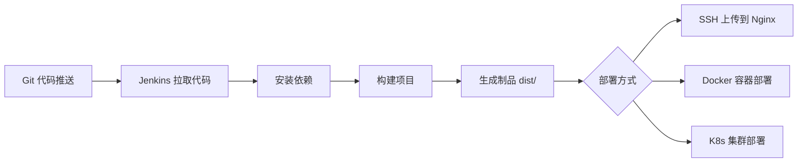
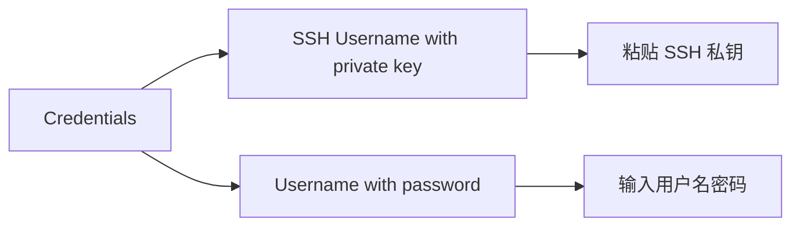

# Jenkins 创建前端 CI/CD 任务

## 概述

本文详解在 Jenkins 中创建前端项目 CI/CD 任务的完整流程，包括任务配置界面各区域功能、Git 源码管理配置、构建触发器设置及构建步骤编排。

## 学习目标

1. 理解前端 CI/CD 最小闭环流程
2. 掌握 Jenkins 自由风格任务的配置方法
3. 能够配置 Git 源码管理与构建触发器

---

## 一、前端 CI/CD 流程



### 本地部署 vs CI/CD 部署

| 步骤 | 本地部署 | CI/CD 部署 |
|------|---------|-----------|
| 拉取代码 | 本地已有 | 从 Git 拉取 |
| 安装依赖 | `npm install` | `npm install` |
| 构建项目 | `npm run build` | `npm run build` |
| 生成制品 | `dist/` 目录 | `dist/` 目录 |
| 部署 | 手动 SSH 上传 | 自动 SSH/Docker |

---

## 二、创建任务

路径：`Dashboard → 新建任务 → 输入名称 → 自由风格项目 → 确定`

### 配置区域总览

| 区域 | 功能 | 常用配置 |
|------|------|---------|
| General | 通用配置 | 描述、丢弃旧构建、参数化 |
| 源码管理 | 从 Git 拉取代码 | Repository URL、分支 |
| 构建触发器 | 触发构建条件 | WebHook、定时、轮询 |
| 构建环境 | 环境和凭证 | SSH Agent、环境变量 |
| 构建步骤 | 具体构建操作 | Shell、Node.js 脚本 |
| 构建后操作 | 后续操作 | 邮件通知、SSH 上传 |

---

## 三、源码管理配置

### Git 仓库配置

| 配置项 | 说明 | 示例 |
|--------|------|------|
| Repository URL | 仓库地址 | `git@gitlab.com:team/project.git` |
| Credentials | 访问凭证 | SSH Key 或用户名密码 |
| Branch Specifier | 分支 | `*/main`、`*/develop` |

### 凭证配置



---

## 四、构建触发器

| 触发方式 | 说明 | 适用场景 |
|---------|------|---------|
| GitLab Web Hook | 代码推送时自动触发 | 推荐，实时性高 |
| Poll SCM | 定期轮询代码变更 | 无法配置 WebHook 时 |
| Build periodically | 定时构建 | 每日定时打包 |
| Trigger builds remotely | 通过 URL 手动触发 | API 调用 |
| Build after other projects | 依赖项目构建后触发 | 项目依赖关系 |

### WebHook 配置要点

1. Jenkins 任务中启用 "Build when a change is pushed to GitLab"
2. 复制生成的 Web Hook URL
3. 在 GitLab 项目中添加 Web Hook（Settings → Webhooks）
4. 选择触发事件（Push events、Merge Request events）

---

## 五、构建步骤

### 前端项目典型构建步骤

```bash
# 步骤一：配置 Node.js 环境（使用 NodeJS Plugin）
# 在构建环境中选择 NodeJS 版本

# 步骤二：安装依赖
npm install --registry=https://registry.npmmirror.com

# 步骤三：构建项目
npm run build

# 步骤四：查看构建产物
ls -la dist/
```

### 构建步骤类型

| 类型 | 使用场景 |
|------|---------|
| Execute shell | Linux 环境执行脚本 |
| Execute Node.js script | Node.js 项目构建 |
| Provide Node & npm bin/ folder to PATH（构建环境选项） | 配置 Node.js 环境 |
| Execute Docker container | Docker 构建环境 |

---

## 六、构建后操作

| 操作 | 说明 |
|------|------|
| Send build artifacts over SSH | 通过 SSH 上传制品到服务器 |
| E-mail Notification | 邮件通知构建结果 |
| Archive the artifacts | 归档构建产物 |
| Delete workspace | 清理工作空间 |

---

## 常见问题

| 问题 | 解决方案 |
|------|---------|
| Git 拉取失败 | 检查凭证配置和网络连通性 |
| WebHook 不触发 | 检查 GitLab WebHook 配置和 Jenkins URL 可达性 |
| 构建超时 | 安装 Build Timeout 插件设置超时时间 |
| 磁盘空间不足 | 配置"丢弃旧的构建"策略 |

---

## 延伸阅读

- [Jenkins 构建任务文档](https://www.jenkins.io/doc/book/using/building-a-software-project/)
- [GitLab Webhook 配置](https://docs.gitlab.com/ee/user/project/integrations/webhooks.html)

---

