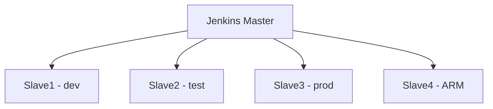

# Jenkins 配置工作节点

## 概述

当构建任务增多时，单节点 Jenkins 面临资源不足和单点故障问题。本文详解 Master-Slave 分布式架构（Jenkins 官方现已改称 Controller-Agent，本文沿用旧称），包括工作节点创建、SSH 连接配置、JDK 环境安装及任务绑定策略。

## 学习目标

1. 理解 Jenkins Master-Slave 架构原理
2. 掌握通过 SSH 添加工作节点的完整流程
3. 能够配置标签实现任务精确分配

---

## 一、Master-Slave 架构



| 角色 | 职责 |
|------|------|
| Master | 任务调度、插件管理、用户权限、Web 界面 |
| Slave | 执行具体构建任务 |

### 为什么需要工作节点

| 问题 | 说明 |
|------|------|
| 资源不足 | Master 节点 CPU/内存有限 |
| 构建队列 | 任务排队等待过长 |
| 单点故障 | 所有任务依赖 Master |
| 环境隔离 | 不同项目需要不同构建环境 |

---

## 二、前置准备

### 安装插件

| 插件 | 功能 | 必要性 |
|------|------|--------|
| SSH Build Agents | 通过 SSH 连接工作节点 | 必装 |

### 工作节点要求

- 安装 JDK（版本与 Master 一致）
- 开放 SSH 端口（默认 22）
- 创建工作目录（如 `/home/jenkins`）

---

## 三、创建工作节点

路径：`系统管理 → 节点管理 → 新建节点`

### 基本配置

| 配置项 | 说明 | 推荐值 |
|--------|------|--------|
| 名称 | 节点唯一标识 | `dev`、`test`、`prod` |
| 执行器数量 | 并行任务数 | CPU 核数（2-4） |
| 远程工作目录 | 节点上的工作路径 | `/home/jenkins` |
| 标签 | 任务绑定标识 | `dev`、`linux`、`arm` |
| 用法 | 使用策略 | 只允许运行绑定的 Job |

### 用法选项

| 选项 | 说明 | 适用 |
|------|------|------|
| 尽可能使用此节点 | 自动分配任务 | 通用节点 |
| 只允许运行绑定的 Job | 仅执行指定标签任务 | 专用节点（推荐） |

---

## 四、SSH 连接配置

### 启动方式

选择：`Launch agents via SSH`

### 配置项

| 配置 | 说明 |
|------|------|
| 主机 | 节点 IP 地址 |
| 端口 | SSH 端口（默认 22） |
| Credentials | SSH 凭证 |
| Host Key Verification | Manually trusted key（推荐） |

### 凭证类型

| 类型 | 配置 |
|------|------|
| Username with password | 用户名 + 密码 |
| SSH Username with private key | 用户名 + SSH 私钥 |

### 高级配置

| 配置项 | 推荐值 |
|--------|--------|
| 连接超时 | 300 秒 |
| 最大重试次数 | 10 |
| 重试间隔 | 5 秒 |

---

## 五、工作节点安装 JDK

Jenkins Agent 需要 Java 运行环境，版本必须与 Master 一致。

```bash
# 查看 Master JDK 版本
docker exec jenkins java -version

# 在 Slave 节点安装（CentOS，Jenkins 2.5xx LTS 要求 Java 17 及以上）
yum search java-17-openjdk
yum install java-17-openjdk-devel -y

# 验证
java -version
```

---

## 六、任务绑定节点

### 自由风格项目

```
General → 限制项目的运行节点 → 标签表达式: dev
```

### Pipeline 项目

```groovy
pipeline {
    agent {
        label 'dev'
    }
    stages {
        stage('Build') {
            steps {
                sh 'npm run build'
            }
        }
    }
}
```

### 标签表达式

| 表达式 | 说明 |
|--------|------|
| `dev` | 匹配标签为 dev 的节点 |
| `linux && x86` | 同时匹配两个标签 |
| `dev \|\| test` | 匹配 dev 或 test |
| `!windows` | 排除 windows 标签 |

---

## 常见问题

| 问题 | 解决方案 |
|------|---------|
| 节点连接失败 | 检查 SSH 端口、凭证、防火墙 |
| Agent 启动报 Java 错误 | 确认 JDK 版本与 Master 一致 |
| 任务未分配到指定节点 | 检查标签配置和用法选项 |
| 节点离线 | 查看节点日志，检查网络连通性 |

---

## 延伸阅读

- [Jenkins 分布式构建文档](https://www.jenkins.io/doc/book/using/using-agents/)
- [SSH Build Agents 插件](https://plugins.jenkins.io/ssh-slaves/)

---

