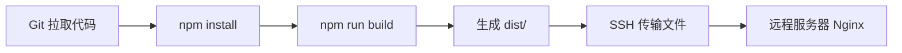
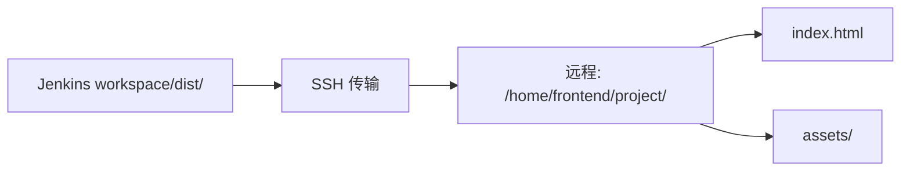

# Jenkins 通过 SSH 发布前端项目

## 概述

本文详解使用 Publish Over SSH 插件将 Jenkins 构建产物发布到远程 Nginx 服务器的完整流程，包括插件安装、SSH Server 配置、密钥认证及构建后操作配置。

## 学习目标

1. 掌握 Publish Over SSH 插件的配置方法
2. 理解 SSH 密钥认证的配置流程
3. 能够配置自动化的文件传输和远程命令执行

---

## 一、发布流程



### 核心步骤

| 步骤 | 操作 |
|------|------|
| 1 | 安装 Publish Over SSH 插件 |
| 2 | 配置 SSH Server（系统配置） |
| 3 | 配置 SSH 密钥认证 |
| 4 | 添加构建后操作 |
| 5 | 配置传输文件和远程命令 |

---

## 二、配置 SSH Server

路径：`系统管理 → 系统配置 → Publish over SSH`

### 参数配置

| 参数 | 说明 | 示例 |
|------|------|------|
| Name | 服务器标识 | `prod-server` |
| Hostname | IP 或域名 | `192.168.1.100` |
| Username | 登录用户 | `root` |
| Remote Directory | 远程基础目录 | `/home` |
| Port | SSH 端口 | `22` |

### 高级配置

| 参数 | 说明 |
|------|------|
| Key | SSH 私钥内容 |
| Key Path | 私钥文件路径 |
| Avoid sending unchanged files | 差异化传输（推荐勾选） |

---

## 三、SSH 密钥认证

### 生成密钥对

```bash
# 在 Jenkins 容器中
docker exec -it jenkins bash
ssh-keygen -t rsa -b 4096 -C "jenkins@deploy"

# 查看私钥（配置到 Jenkins）
cat ~/.ssh/id_rsa

# 查看公钥（配置到远程服务器）
cat ~/.ssh/id_rsa.pub
```

### 远程服务器配置公钥

```bash
# 在远程服务器上
mkdir -p ~/.ssh && chmod 700 ~/.ssh
echo "公钥内容" >> ~/.ssh/authorized_keys
chmod 600 ~/.ssh/authorized_keys
```

### 验证连接

在 Jenkins 系统配置中点击 "Test Configuration"，显示 "Success" 即配置成功。

---

## 四、构建后操作配置

### 添加 SSH 发布

```
构建后操作 → Send build artifacts over SSH
```

### 配置项

| 配置 | 说明 | 示例 |
|------|------|------|
| Source files | 传输的文件（ant 通配符） | `dist/**` |
| Remove prefix | 移除路径前缀 | `dist` |
| Remote directory | 远程目标目录 | `/frontend/project` |
| Exec command | 远程执行命令 | 见下方 |

### 远程命令示例

```bash
# 重启 Nginx
11-Nginx基础概述 -s reload

# 或执行部署脚本
/home/deploy/restart.sh
```

### 文件传输说明



- Source files: `dist/**` → 匹配 dist 下所有文件
- Remove prefix: `dist` → 传输时去掉 dist 前缀
- Remote directory: 相对于 Remote Directory 的路径

---

## 五、完整构建配置

### 构建步骤（Shell）

```bash
# 安装依赖
npm install --registry=https://registry.npmmirror.com

# 构建项目
npm run build

# 验证产物
ls -la dist/
```

### Nginx 配置（远程服务器）

```11-Nginx基础概述
server {
    listen 80;
    server_name example.com;
    root /home/frontend/project;
    index index.html;

    location / {
        try_files $uri $uri/ /index.html;
    }

    location /assets {
        expires 1y;
        add_header Cache-Control "public, immutable";
    }
}
```

---

## 常见问题

| 问题 | 解决方案 |
|------|---------|
| SSH 连接失败 | 检查密钥配置、防火墙、端口 |
| 文件传输失败 | 确认远程目录存在且有写权限 |
| 权限被拒绝 | 检查远程目录权限 `chmod 755` |
| 传输速度慢 | 勾选差异化传输 |

---

## 延伸阅读

- [Publish Over SSH 插件](https://plugins.jenkins.io/publish-over-ssh/)
- [Nginx 部署前端项目](https://11-Nginx基础概述.org/en/docs/)

---

