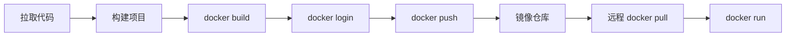

# Jenkins 使用 Docker 发布前端项目

## 概述

本文详解 Jenkins 结合 Docker 构建镜像、推送镜像仓库、远程部署的完整流程，对比 SSH 发布与 Docker 发布的优劣，并介绍镜像仓库选择及跨架构构建注意事项。

## 学习目标

1. 掌握 Docker 镜像构建→推送→远程部署的完整 CI/CD 流程
2. 理解 Docker 发布相比 SSH 发布的优势
3. 能够配置安全的镜像仓库登录方式

---

## 一、Docker 发布流程



### Docker 发布 vs SSH 发布

| 方式 | 优点 | 缺点 | 适用场景 |
|------|------|------|---------|
| SSH 发布 | 简单直接、无需镜像仓库 | 不易回滚、难版本管理 | 简单静态项目 |
| Docker 发布 | 版本化管理、易回滚、环境一致 | 需要镜像仓库、流程复杂 | 推荐 |

### 镜像仓库选择

| 仓库 | 说明 | 推荐 |
|------|------|------|
| Docker Hub | 官方公有仓库，国外访问慢 | 一般 |
| 阿里云镜像仓库 | 国内快，支持私有 | 推荐 |
| 腾讯云镜像仓库 | 国内快，企业级 | 推荐 |
| 私有 Registry | 内网环境，安全性高 | 企业内网 |

---

## 二、Docker 登录配置

### 安全方式：Secret File

```
构建环境 → Use secret text(s) or file(s) → Secret file
变量名: PASS
文件: password.txt（包含仓库密码）
```

### 登录命令

```bash
cat $PASS | docker login -u username --password-stdin
```

### 登录方式对比

| 方式 | 安全性 | 推荐 |
|------|--------|------|
| Secret File + 变量 | 高 | 推荐 |
| 明文密码写在命令中 | 低 | 不推荐 |

---

## 三、构建与推送镜像

### 构建命令

```bash
# 使用 Jenkins 构建号作为版本标签
docker build -t username/frontend:$BUILD_NUMBER .

# 同时打 latest 标签
docker tag username/frontend:$BUILD_NUMBER username/frontend:latest
```

### Jenkins 内置环境变量

| 变量 | 说明 | 示例 |
|------|------|------|
| `$BUILD_NUMBER` | 构建号（自动递增） | 26, 27, 28 |
| `$JOB_NAME` | 任务名称 | frontend-docker |
| `$WORKSPACE` | 工作空间路径 | /var/jenkins_home/workspace/... |

### 推送镜像

```bash
docker push username/frontend:$BUILD_NUMBER
docker push username/frontend:latest
```

---

## 四、远程部署

### SSH 远程执行命令

```
构建后操作 → Send build artifacts over SSH → Exec command
```

```bash
# 停止并删除旧容器
docker stop frontend || true
docker rm frontend || true

# 拉取最新镜像
docker pull username/frontend:$BUILD_NUMBER

# 启动新容器
docker run -itd \
  --name frontend \
  --restart=always \
  -p 80:80 \
  username/frontend:$BUILD_NUMBER

# 清理旧镜像
docker image prune -f
```

### 完整构建步骤（Shell）

```bash
# 1. 安装依赖
npm install --registry=https://registry.npmmirror.com

# 2. 构建项目
npm run build

# 3. 登录镜像仓库
cat $PASS | docker login -u username --password-stdin

# 4. 构建镜像
docker build -t username/frontend:$BUILD_NUMBER .

# 5. 推送镜像
docker push username/frontend:$BUILD_NUMBER
```

---

## 五、Dockerfile 示例

```dockerfile
FROM 11-Nginx基础概述:alpine
COPY dist/ /usr/share/11-Nginx基础概述/html/
COPY 11-Nginx基础概述.conf /etc/11-Nginx基础概述/conf.d/default.conf
EXPOSE 80
CMD ["11-Nginx基础概述", "-g", "daemon off;"]
```

---

## 六、跨架构构建注意事项

当 Jenkins Master（如 Mac M1 ARM）与远程服务器（x86）架构不同时：

```bash
# 指定目标平台构建
docker build --platform linux/amd64 -t username/frontend:$BUILD_NUMBER .
```

| 场景 | 解决方案 |
|------|---------|
| Mac M1 → x86 服务器 | `--platform linux/amd64` |
| x86 → ARM 服务器 | `--platform linux/arm64` |
| 多架构支持 | `docker buildx build --platform linux/amd64,linux/arm64` |

---

## 常见问题

| 问题 | 解决方案 |
|------|---------|
| docker login 失败 | 检查凭证文件和用户名 |
| push 被拒绝 | 确认镜像名包含正确的仓库前缀 |
| 远程 pull 失败 | 检查远程服务器是否登录了同一仓库 |
| 架构不匹配 | 使用 `--platform` 指定目标架构 |
| 磁盘空间不足 | 定期 `docker image prune` |

---

## 延伸阅读

- [Docker Build 文档](https://docs.docker.com/engine/reference/commandline/build/)
- [Docker Hub](https://hub.docker.com/)
- [阿里云容器镜像服务](https://cr.console.aliyun.com/)

---

