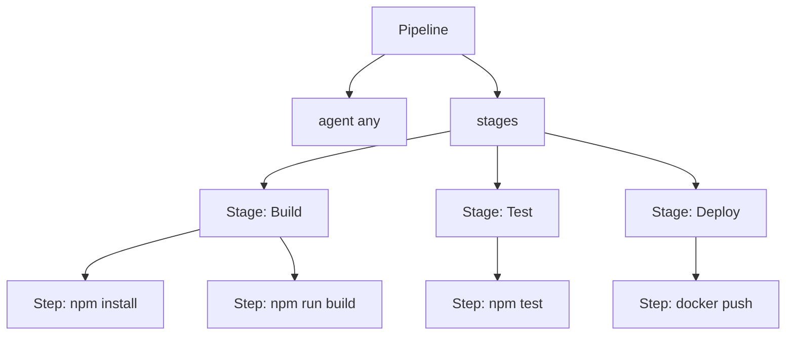

# Jenkins Pipeline 进阶使用

## 概述

Jenkins Pipeline 通过 Jenkinsfile 将 CI/CD 流程代码化，支持版本控制、复用和可视化。本文详解 Pipeline 核心概念、Jenkinsfile 语法、前端项目完整示例及 Blue Ocean 可视化界面。

## 学习目标

1. 理解 Pipeline 核心概念（Agent、Stage、Step）
2. 掌握 Jenkinsfile 声明式语法
3. 能够编写前端项目的完整 Pipeline 配置

---

## 一、Pipeline vs 传统 GUI

| 对比项 | 传统 GUI 配置 | Pipeline（Jenkinsfile） |
|--------|-------------|----------------------|
| 配置方式 | 图形界面点击 | 代码配置文件 |
| 版本控制 | 不方便 | 天然支持 Git |
| 可复用性 | 需手动复制 | 修改参数即可 |
| 团队协作 | 配置分散 | 统一管理 |
| 可视化 | 基础 | Blue Ocean |

### Pipeline 优势

- 代码化：CI/CD 流程以代码形式存在
- 标准化：配置文件可复用
- 可追溯：每次修改有版本记录
- 易迁移：学习 GitHub Actions/GitLab CI 更轻松

---

## 二、核心概念

| 概念 | 说明 | 示例 |
|------|------|------|
| Pipeline | 整个流水线定义 | 包含所有阶段 |
| Agent | 指定执行节点 | `agent any` / `agent { label 'dev' }` |
| Stage | 阶段，划分流程 | Build、Test、Deploy |
| Step | 步骤，具体操作 | `sh 'npm install'` |
| Tools | 工具配置 | `nodejs 'node-22'` |



---

## 三、Jenkinsfile 基础语法

### 最小结构

```groovy
pipeline {
    agent any

    stages {
        stage('Build') {
            steps {
                echo 'Building...'
            }
        }
        stage('Test') {
            steps {
                echo 'Testing...'
            }
        }
        stage('Deploy') {
            steps {
                echo 'Deploying...'
            }
        }
    }
}
```

### 完整 Vue 项目示例

```groovy
pipeline {
    agent any

    tools {
        nodejs 'node-22'
    }

    environment {
        REGISTRY = 'registry.cn-hangzhou.aliyuncs.com'
        IMAGE_NAME = 'myteam/frontend'
    }

    stages {
        stage('Checkout') {
            steps {
                git branch: 'main',
                    credentialsId: 'gitlab-ssh-key',
                    url: 'git@gitlab.com:team/frontend.git'
            }
        }

        stage('Install') {
            steps {
                sh 'npm install --registry=https://registry.npmmirror.com'
            }
        }

        stage('Build') {
            steps {
                sh 'npm run build'
            }
        }

        stage('Test') {
            steps {
                sh 'npm run test:unit || true'
            }
        }

        stage('Docker Build') {
            steps {
                sh "docker build -t ${REGISTRY}/${IMAGE_NAME}:${BUILD_NUMBER} ."
            }
        }

        stage('Deploy') {
            steps {
                sh "docker push ${REGISTRY}/${IMAGE_NAME}:${BUILD_NUMBER}"
            }
        }
    }

    post {
        success {
            echo 'Pipeline succeeded!'
        }
        failure {
            echo 'Pipeline failed!'
        }
        always {
            cleanWs()
        }
    }
}
```

---


## 四、常用指令

### Agent 选项

| 写法 | 说明 |
|------|------|
| `agent any` | 任何可用节点 |
| `agent none` | 不指定（每个 stage 单独指定） |
| `agent { label 'dev' }` | 指定标签节点 |
| `agent { docker { image 'node:22' } }` | Docker 容器内执行 |

### Post 条件

| 条件 | 触发时机 |
|------|---------|
| `always` | 无论结果都执行 |
| `success` | 成功时执行 |
| `failure` | 失败时执行 |
| `unstable` | 不稳定时执行 |

### 常用 Step

| Step | 说明 |
|------|------|
| `sh 'command'` | 执行 Shell 命令 |
| `echo 'message'` | 输出信息 |
| `git url: '...'` | 拉取代码 |
| `archiveArtifacts 'dist/**'` | 归档产物 |
| `cleanWs()` | 清理工作空间 |

---

## 五、创建 Pipeline 任务

```
Dashboard → 新建任务 → 输入名称 → Pipeline → 确定
```

### Pipeline 定义方式

| 方式 | 说明 | 推荐 |
|------|------|------|
| Pipeline script | 直接在界面编写 | 测试用 |
| Pipeline script from SCM | 从 Git 仓库读取 Jenkinsfile | 推荐 |

### 从 SCM 读取

```
Pipeline → Definition: Pipeline script from SCM
         → SCM: Git
         → Repository URL: git@gitlab.com:team/project.git
         → Script Path: Jenkinsfile
```

---

## 六、Blue Ocean 可视化

Blue Ocean 提供 Pipeline 的现代化可视化界面（注意：Blue Ocean 已停止活跃开发，仅建议存量使用）：

| 功能 | 说明 |
|------|------|
| 可视化编辑 | 图形化编辑 Pipeline |
| 流程展示 | 清晰展示各阶段状态 |
| 快速诊断 | 快速定位失败步骤 |
| 日志查看 | 按阶段查看构建日志 |

安装：`插件管理 → 搜索 Blue Ocean → 安装`

访问：`Jenkins 首页 → Open Blue Ocean`

---

## 常见问题

| 问题 | 解决方案 |
|------|---------|
| Jenkinsfile 语法错误 | 使用 Pipeline Syntax 工具验证 |
| tools 指令不生效 | 确认已安装对应插件（NodeJS Plugin） |
| post 不执行 | 检查语法位置（与 stages 同级） |
| 环境变量未生效 | 确认在 environment 块中定义 |

---

## 延伸阅读

- [Jenkins Pipeline 语法文档](https://www.jenkins.io/doc/book/pipeline/syntax/)
- [Blue Ocean 插件](https://plugins.jenkins.io/blueocean/)
- [Jenkins Pipeline 示例库](https://www.jenkins.io/doc/pipeline/examples/)

---


