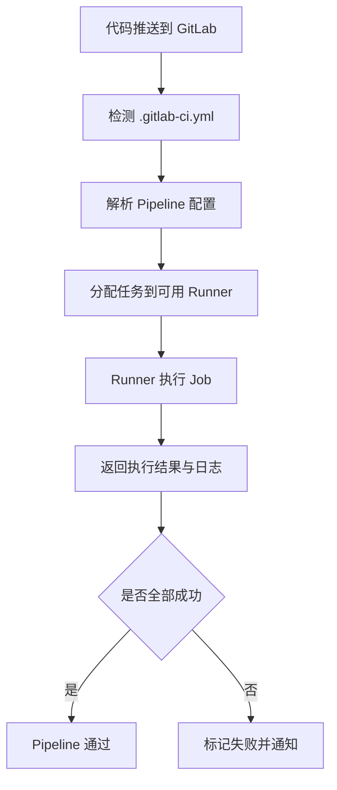
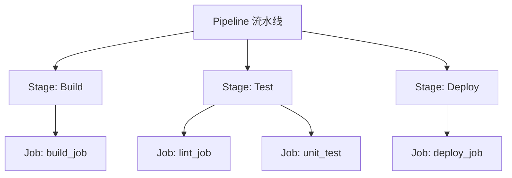
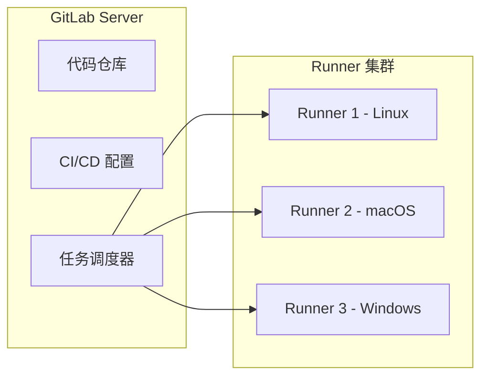
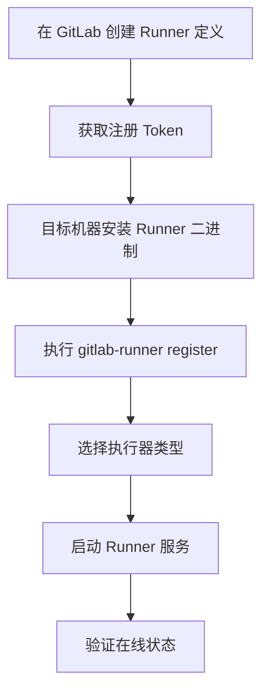

# GitLab CI/CD 入门

## 概述

GitLab CI/CD 是 GitLab 内置的持续集成与持续交付解决方案，通过 `.gitlab-ci.yml` 配置文件驱动流水线执行，无需额外部署独立 CI 服务。本文介绍 CI/CD 工具生态分类、GitLab CI/CD 核心架构，以及 GitLab Runner 的安装与执行器选择。

## 学习目标

- 理解 CI/CD 工具生态的三大分类及各自适用场景
- 掌握 GitLab CI/CD 与 Jenkins 的核心差异
- 理解 GitLab Runner 架构与三种 Runner 类型
- 完成 GitLab Runner 的安装、注册与执行器配置

---

## 一、CI/CD 工具生态

### 1.1 工具分类

CI/CD 工具按部署模式和集成方式可分为三类：

| 分类 | 代表工具 | 特点 | 适用场景 |
|------|---------|------|---------|
| 云平台型 | Travis CI、CircleCI | 零运维、开箱即用 | 开源项目、中小团队 |
| 自托管型 | Jenkins、GitLab CI（私有部署） | 灵活可控、数据自主 | 企业级项目、安全合规要求 |
| 版本库集成型 | GitHub Actions、GitLab CI/CD | 与代码仓库深度绑定 | 对应平台托管项目 |

### 1.2 主流工具对比

| 工具 | 配置方式 | 学习曲线 | 插件生态 | 核心优势 |
|------|---------|---------|---------|---------|
| Jenkins | GUI + Groovy Pipeline | 中等 | 2000+ 插件 | 功能最全面、企业积累深 |
| GitHub Actions | YAML | 低 | Marketplace | 与 GitHub 无缝集成 |
| GitLab CI/CD | YAML | 低 | 无需插件 | 内置集成、配置驱动 |
| Travis CI | YAML | 低 | 有限 | 开源项目免费 |

### 1.3 学习路径建议

Jenkins 作为行业积累最深的 CI 工具，其概念模型（任务、节点、插件、Pipeline）具有高度可迁移性。掌握 Jenkins 后再学习 GitLab CI/CD，核心思想触类旁通，主要差异在于配置方式和集成模式。

---

## 二、GitLab CI/CD 核心架构

### 2.1 与 Jenkins 的对比

| 对比维度 | GitLab CI/CD | Jenkins |
|---------|-------------|---------|
| 部署方式 | 内置于 GitLab | 独立部署 |
| 配置格式 | YAML（.gitlab-ci.yml） | Groovy（Jenkinsfile） |
| 执行节点 | GitLab Runner | 工作节点（Agent） |
| 可视化 | 内置流水线视图 | 需安装 Blue Ocean |
| 扩展方式 | 无需插件，Docker 镜像驱动 | 插件生态 |
| 触发方式 | 代码推送自动触发 | 多种触发器配置 |

### 2.2 核心执行流程



### 2.3 核心概念层级



- **Pipeline**：一次完整的 CI/CD 流程，由代码推送触发
- **Stage**：执行阶段，按定义顺序串行执行
- **Job**：具体任务单元，同一 Stage 内的 Job 并行执行

---

## 三、GitLab Runner

### 3.1 Runner 架构

GitLab Runner 是独立于 GitLab Server 的执行代理，负责接收并执行 CI/CD 作业：



### 3.2 Runner 类型

| 类型 | 作用域 | 适用场景 |
|------|--------|---------|
| Shared Runner | 全实例所有项目 | 公共构建、小型团队 |
| Group Runner | 特定 Group 下的项目 | 部门级资源共享 |
| Specific Runner | 指定项目 | 企业项目、特殊环境需求 |

### 3.3 矩阵化构建

Runner 支持跨平台并行构建，适用于需要多平台产物的场景：

- iOS 应用需要 macOS Runner
- Windows 桌面应用需要 Windows Runner
- 跨平台兼容性测试需要多平台同时执行

---

## 四、Runner 安装与注册


### 4.1 安装流程



### 4.2 Linux 安装

```bash
# 下载 Runner 二进制（x86_64）
sudo curl -L --output /usr/local/bin/gitlab-runner \
  https://gitlab-runner-downloads.s3.amazonaws.com/latest/binaries/gitlab-runner-linux-amd64

# ARM 架构使用 gitlab-runner-linux-arm64

# 赋予执行权限
sudo chmod +x /usr/local/bin/gitlab-runner

# 创建专用用户
sudo useradd --comment 'GitLab Runner' --create-home gitlab-runner --shell /bin/bash

# 安装并启动服务
sudo gitlab-runner install --user=gitlab-runner --working-directory=/home/gitlab-runner
sudo gitlab-runner start
```

### 4.3 macOS 安装

```bash
brew install gitlab-runner
gitlab-runner install
gitlab-runner start
```

### 4.4 注册 Runner

```bash
sudo gitlab-runner register
```

交互式配置项：

| 配置项 | 说明 | 示例 |
|--------|------|------|
| GitLab URL | GitLab 实例地址 | `https://gitlab.example.com` |
| Registration Token | 从 GitLab 页面获取 | `glrt-xxxxxxxxxxxx` |
| Description | Runner 描述 | `frontend-builder` |
| Tags | 标签标识 | `docker,linux,frontend` |
| Executor | 执行器类型 | `docker` |
| Default Image | 默认 Docker 镜像 | `node:22-alpine` |

---

## 五、执行器选择

### 5.1 执行器类型对比

| 执行器 | 隔离性 | 性能 | 配置复杂度 | 推荐场景 |
|--------|--------|------|-----------|---------|
| shell | 无 | 高 | 低 | 简单脚本任务 |
| docker | 高 | 中 | 中 | 通用场景（推荐） |
| docker+machine | 高 | 中 | 高 | 大规模弹性构建 |
| kubernetes | 高 | 中 | 高 | 云原生环境 |
| ssh | 中 | 低 | 中 | 跨机器远程执行 |

### 5.2 推荐 Docker Executor

Docker 执行器是前端项目的首选方案：

- **环境隔离**：每次构建在独立容器中执行，互不干扰
- **环境一致性**：通过镜像锁定构建环境，消除"本地能跑"问题
- **灵活切换**：不同 Job 可指定不同镜像（如 Node 20/22/24）
- **零污染**：构建完成后容器销毁，不残留任何状态

### 5.3 配置文件示例

Runner 注册后生成配置文件 `/etc/gitlab-runner/config.toml`：

```toml
[runners]
  name = "frontend-builder"
  url = "https://gitlab.example.com"
  executor = "docker"
  [runners.docker]
    image = "node:22-alpine"
    privileged = false
    volumes = ["/cache"]
    pull_policy = "if-not-present"
```

### 5.4 常用基础镜像

| 镜像 | 适用场景 |
|------|---------|
| `node:22-alpine` | 前端构建（体积小、速度快） |
| `node:22` | 需要完整系统工具的构建 |
| `docker:latest` | Docker-in-Docker 镜像构建 |
| `alpine:latest` | 轻量部署任务（rsync/ssh） |

---

## 常见问题

**Q: Runner 注册后显示离线怎么办？**

检查 Runner 服务是否启动（`sudo gitlab-runner status`），确认网络能访问 GitLab 实例，查看日志 `sudo gitlab-runner --debug run` 排查连接问题。

**Q: Docker Executor 中如何访问宿主机的 Docker？**

挂载 `/var/run/docker.sock` 到容器中，或使用 `docker:dind` 服务（Docker-in-Docker 模式）。前者性能更好，后者隔离性更强。

**Q: 如何为不同项目指定不同 Runner？**

通过 Tags 机制实现。注册 Runner 时设置标签，在 `.gitlab-ci.yml` 的 Job 中通过 `tags` 关键字指定匹配的 Runner。

---

## 延伸阅读

- 官方文档：[GitLab CI/CD Documentation](https://docs.gitlab.com/ee/ci/)

