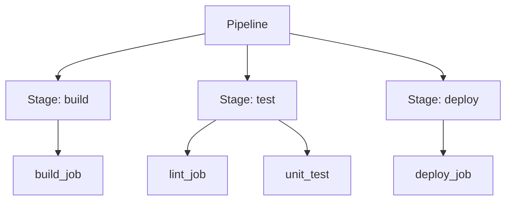
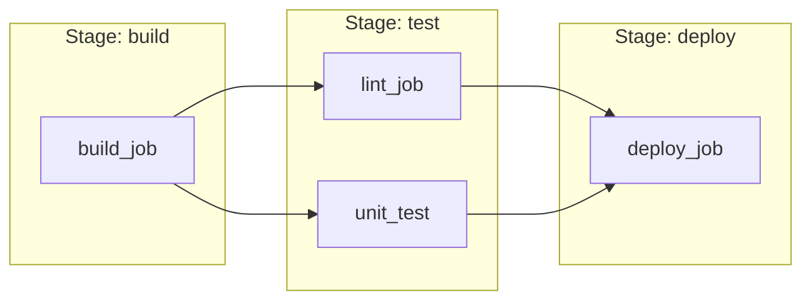
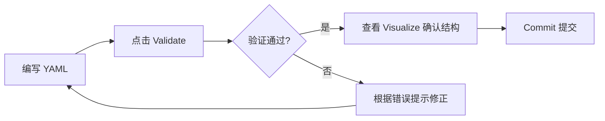

# GitLab CI 配置文件编写

## 概述

`.gitlab-ci.yml` 是 GitLab CI/CD 的核心配置文件，采用 YAML 格式定义流水线的阶段、任务和执行规则。本文系统讲解配置文件的核心概念、关键字语法和流水线编辑器的使用方法。

## 学习目标

- 掌握 Pipeline / Stage / Job 三层概念模型及执行规则
- 熟练使用常用 Job 关键字（image、script、artifacts、cache、rules）
- 理解分支控制与条件执行的多种方式
- 学会使用流水线编辑器进行配置验证

---

## 一、配置文件基础

### 1.1 文件规范

| 属性 | 说明 |
|------|------|
| 文件名 | `.gitlab-ci.yml` |
| 位置 | 项目根目录 |
| 格式 | YAML |
| 触发时机 | 代码推送到仓库时自动检测并执行 |

### 1.2 与 Jenkins Pipeline 的对比

| 对比项 | Jenkins Pipeline | GitLab CI |
|--------|-----------------|-----------|
| 配置文件 | Jenkinsfile | .gitlab-ci.yml |
| 语言 | Groovy | YAML |
| 语法复杂度 | 较高（DSL） | 较低（声明式） |
| 可视化编辑 | Blue Ocean | 内置流水线编辑器 |
| 验证方式 | 语法检查器 | Lint 验证 |

### 1.3 最简配置

```yaml
# .gitlab-ci.yml

stages:
  - build
  - test
  - deploy

build_job:
  stage: build
  script:
    - echo "Building..."
    - npm run build

test_job:
  stage: test
  script:
    - npm test

deploy_job:
  stage: deploy
  script:
    - echo "Deploying..."
```

---

## 二、核心概念

### 2.1 三层结构



| 概念 | 说明 |
|------|------|
| Pipeline | 一次完整的 CI/CD 执行流程 |
| Stage | 执行阶段，定义任务的串行顺序 |
| Job | 最小执行单元，包含具体脚本命令 |
| Script | Job 中执行的命令列表（必需） |

### 2.2 执行规则

三条核心规则：

1. **Stage 串行**：按 `stages` 数组定义的顺序依次执行，前一阶段完成后才进入下一阶段
2. **Job 并行**：同一 Stage 内的多个 Job 并行执行（受 Runner 数量限制）
3. **失败阻断**：任一 Job 失败，该 Stage 标记为失败，后续 Stage 不再执行



---

## 三、全局配置

### 3.1 配置文件结构

```yaml
# ===== 全局配置区 =====

# 阶段定义
stages:
  - build
  - test
  - deploy

# 全局变量
variables:
  NODE_ENV: "production"
  REGISTRY: "https://registry.npmmirror.com"

# 全局默认配置
default:
  image: node:22-alpine
  before_script:
    - npm install --registry=$REGISTRY

# ===== Job 定义区 =====

build_job:
  stage: build
  script:
    - npm run build
```

### 3.2 全局关键字

| 关键字 | 作用 | 示例 |
|--------|------|------|
| `stages` | 定义阶段顺序 | `stages: [build, test, deploy]` |
| `variables` | 全局变量 | `variables: {NODE_ENV: "production"}` |
| `default` | 所有 Job 的默认配置 | `default: {image: node:22}` |
| `workflow` | 控制 Pipeline 是否执行 | `workflow: {rules: [...]}` |

---

## 四、Job 关键字详解

### 4.1 关键字速查表

| 关键字 | 说明 | 必需 |
|--------|------|------|
| `script` | 执行的命令列表 | 是 |
| `stage` | 所属阶段 | 否（默认 test） |
| `image` | Docker 镜像 | 否 |
| `before_script` | 主脚本前执行 | 否 |
| `after_script` | 主脚本后执行（即使失败） | 否 |
| `artifacts` | 制品配置 | 否 |
| `cache` | 缓存配置 | 否 |
| `only` / `except` | 分支过滤 | 否 |
| `rules` | 条件规则（推荐） | 否 |
| `tags` | 指定 Runner 标签 | 否 |
| `when` | 执行时机 | 否 |
| `needs` | DAG 依赖 | 否 |
| `allow_failure` | 允许失败不阻断 | 否 |
| `environment` | 部署环境声明 | 否 |

### 4.2 script

```yaml
job_name:
  script:
    - echo "单行命令"
    - |
      echo "多行命令块"
      npm run build
      ls -la dist/
```

### 4.3 image

```yaml
# 全局默认镜像
default:
  image: node:22-alpine

# Job 级别覆盖
deploy_job:
  image: alpine:latest
  script:
    - apk add --no-cache rsync openssh
```

### 4.4 artifacts（制品）

```yaml
build_job:
  stage: build
  script:
    - npm run build
  artifacts:
    paths:
      - dist/
    exclude:
      - dist/**/*.map
    expire_in: 1 week
    when: on_success
```

制品在 Stage 间自动传递：下游 Job 的工作目录中可直接访问上游产出的文件。


### 4.5 cache（缓存）

```yaml
build_job:
  cache:
    key: ${CI_COMMIT_REF_SLUG}
    paths:
      - node_modules/
  script:
    - npm install
    - npm run build
```

`cache` 与 `artifacts` 的区别：

| 对比 | cache | artifacts |
|------|-------|-----------|
| 用途 | 加速依赖安装 | 传递构建产物 |
| 生命周期 | 跨 Pipeline 保留 | 有过期时间 |
| 作用域 | 可跨项目共享 | 仅当前 Pipeline |

### 4.6 分支控制

```yaml
# 方式一：only / except（简单场景）
deploy_job:
  only:
    - main
    - release/*
  except:
    - feature/*

# 方式二：rules（推荐，更灵活）
deploy_job:
  rules:
    - if: $CI_COMMIT_BRANCH == "main"
      when: manual
    - if: $CI_COMMIT_BRANCH == "develop"
      when: on_success
    - when: never
```

### 4.7 tags（Runner 选择）

```yaml
build_job:
  tags:
    - docker
    - linux
  script:
    - npm run build
```

通过 tags 将 Job 调度到具有对应标签的 Runner 上执行。

### 4.8 needs（DAG 依赖）

```yaml
deploy_job:
  stage: deploy
  needs:
    - build_job
  script:
    - echo "无需等待整个 test 阶段完成"
```

`needs` 打破 Stage 串行限制，实现有向无环图（DAG）执行，缩短 Pipeline 总耗时。

---

## 五、流水线编辑器

### 5.1 访问路径

```
项目 → 构建（Build） → 流水线编辑器（Pipeline Editor）
```

### 5.2 三大功能

| 功能 | 说明 |
|------|------|
| 编辑（Edit） | YAML 在线编辑，语法高亮 |
| 可视化（Visualize） | 图形化展示 Stage 和 Job 关系 |
| 验证（Validate） | 检查 YAML 语法和配置合法性 |

### 5.3 推荐使用流程



---

## 六、前端项目完整示例

```yaml
# .gitlab-ci.yml - Vue/React 前端项目

stages:
  - install
  - lint
  - build
  - deploy

variables:
  NPM_REGISTRY: "https://registry.npmmirror.com"

default:
  image: node:22-alpine
  cache:
    key: ${CI_COMMIT_REF_SLUG}
    paths:
      - node_modules/

install_deps:
  stage: install
  script:
    - npm install --registry=$NPM_REGISTRY

lint_check:
  stage: lint
  script:
    - npm run lint

build_project:
  stage: build
  script:
    - npm run build
  artifacts:
    paths:
      - dist/
    expire_in: 3 days

deploy_production:
  stage: deploy
  image: alpine:latest
  before_script:
    - apk add --no-cache rsync openssh
    - mkdir -p ~/.ssh
    - echo "$SSH_PRIVATE_KEY" > ~/.ssh/id_rsa
    - chmod 600 ~/.ssh/id_rsa
    - ssh-keyscan -H $SERVER_HOST >> ~/.ssh/known_hosts
  script:
    - rsync -avz --delete dist/ $SSH_USER@$SERVER_HOST:$DEPLOY_PATH/
  rules:
    - if: $CI_COMMIT_BRANCH == "main"
      when: manual
```

---

## 常见问题

**Q: 未指定 stage 的 Job 属于哪个阶段？**

默认属于 `test` 阶段。GitLab 内置了 `build`、`test`、`deploy` 三个默认阶段，如果未显式定义 `stages`，则使用这三个。

**Q: only/except 和 rules 应该用哪个？**

推荐使用 `rules`。`only/except` 是旧版语法，功能有限且不支持复杂条件组合；`rules` 支持变量判断、正则匹配、手动触发等高级场景，且两者不能在同一 Job 中混用。

**Q: artifacts 和 cache 可以同时使用吗？**

可以。典型模式是用 `cache` 缓存 `node_modules/` 加速安装，用 `artifacts` 传递 `dist/` 给下游部署 Job。

---

## 延伸阅读

- 官方文档：[GitLab CI/CD YAML Reference](https://docs.gitlab.com/ee/ci/yaml/)

