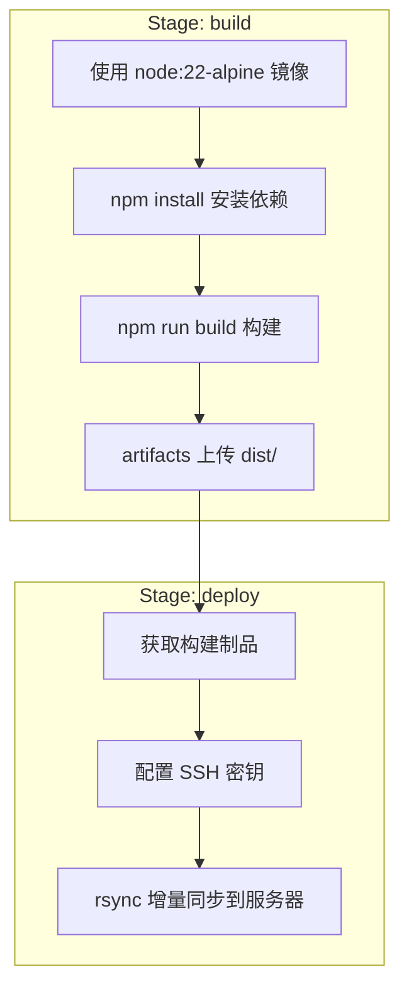
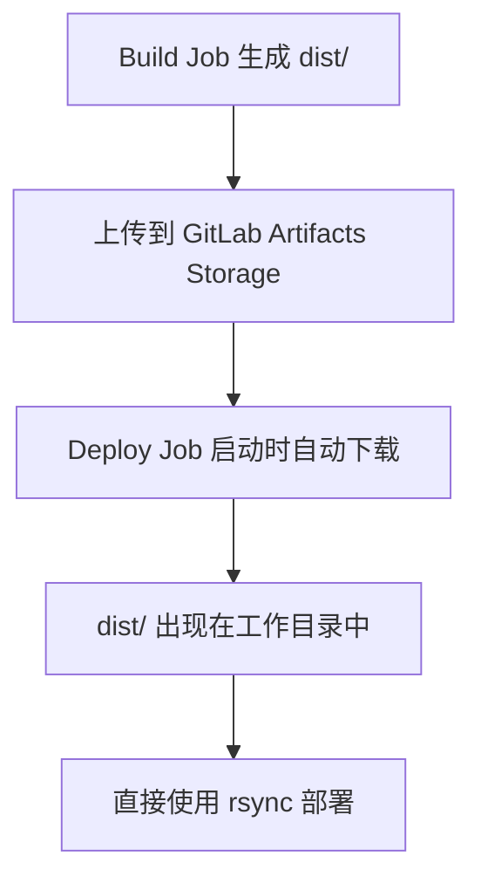

# GitLab CI/CD 项目部署实战

## 概述

本文以 Vue/React 前端项目为例，完整实现 GitLab CI/CD 从构建到部署的全流程：使用 Node.js 镜像构建项目、通过 artifacts 传递制品、配置 SSH 密钥实现 rsync 增量部署，并深入讲解 CI/CD 变量管理与分支保护机制。

## 学习目标

- 掌握 GitLab CI/CD 前端项目完整部署流程
- 熟练使用 artifacts 实现跨 Stage 制品传递
- 掌握 SSH 密钥配置与 rsync 远程部署
- 理解 CI/CD 变量的保护机制与分支保护的关系

---

## 一、部署流程设计

### 1.1 完整 CI/CD 流程



### 1.2 与 Jenkins 的概念映射

| 步骤 | Jenkins | GitLab CI |
|------|---------|-----------|
| 环境配置 | 全局工具配置（NodeJS Plugin） | `image` 关键字 |
| 制品管理 | Archive the artifacts | `artifacts` 关键字 |
| 部署方式 | Publish Over SSH 插件 | rsync / scp 命令 |
| 密钥管理 | Credentials Binding | CI/CD Variables |
| 触发控制 | 构建触发器 | `rules` / `only` |

---

## 二、构建阶段

### 2.1 基础构建配置

```yaml
stages:
  - build
  - deploy

build:
  stage: build
  image: node:22-alpine
  script:
    - npm install --registry=https://registry.npmmirror.com
    - npm run build
    - ls -la dist/
  artifacts:
    paths:
      - dist/
    expire_in: 1 week
```

### 2.2 镜像选择

| 镜像 | 体积 | 适用场景 |
|------|------|---------|
| `node:22` | ~1GB | 需要完整系统工具（如 node-gyp） |
| `node:22-alpine` | ~170MB | 纯前端构建（推荐） |
| `node:22-slim` | ~250MB | 需要部分系统工具 |

alpine 镜像体积最小、拉取最快，是前端构建的首选。若构建过程中需要编译原生模块（如 `node-sass`），则需使用完整版镜像或安装 `python3 make g++`。

### 2.3 缓存优化

```yaml
build:
  stage: build
  image: node:22-alpine
  cache:
    key: ${CI_COMMIT_REF_SLUG}
    paths:
      - node_modules/
  script:
    - npm install --registry=https://registry.npmmirror.com
    - npm run build
  artifacts:
    paths:
      - dist/
    expire_in: 1 week
```

---

## 三、Artifacts 制品管理

### 3.1 核心参数

| 参数 | 说明 | 示例 |
|------|------|------|
| `paths` | 制品文件路径 | `paths: [dist/]` |
| `exclude` | 排除的文件 | `exclude: [dist/**/*.map]` |
| `expire_in` | 过期时间 | `expire_in: 1 week` |
| `when` | 保存时机 | `on_success` / `always` |
| `name` | 制品名称 | `name: "build-$CI_COMMIT_SHORT_SHA"` |

### 3.2 传递机制



制品传递是自动的：下游 Stage 的 Job 启动时，GitLab 会自动将上游 Job 的 artifacts 下载到工作目录中，无需手动配置。

### 3.3 查看与下载

在 Pipeline 详情页中：点击具体 Job → 右侧「作业产物」→ 下载。

---

## 四、部署阶段

### 4.1 部署方式对比

| 方式 | 特点 | 适用场景 |
|------|------|---------|
| scp | 简单，每次全量传输 | 小型项目、文件少 |
| rsync | 增量同步，只传差异 | 生产环境（推荐） |

### 4.2 rsync 参数

| 参数 | 说明 |
|------|------|
| `-a` | 归档模式，保留权限、时间戳等 |
| `-v` | 显示详细传输信息 |
| `-z` | 压缩传输，节省带宽 |
| `--delete` | 删除目标端多余文件（保持同步） |
| `--exclude` | 排除指定文件 |

### 4.3 部署 Job 配置

```yaml
deploy:
  stage: deploy
  image: alpine:latest
  before_script:
    # 安装必要工具
    - apk add --no-cache rsync openssh

    # 配置 SSH 密钥
    - mkdir -p ~/.ssh
    - echo "$SSH_PRIVATE_KEY" > ~/.ssh/id_rsa
    - chmod 600 ~/.ssh/id_rsa

    # 信任目标服务器
    - ssh-keyscan -H $SERVER_HOST >> ~/.ssh/known_hosts
  script:
    - rsync -avz --delete dist/ $SSH_USER@$SERVER_HOST:$DEPLOY_PATH/
  rules:
    - if: $CI_COMMIT_BRANCH == "main"
```

---

## 五、CI/CD 变量配置

### 5.1 变量分类

| 类别 | 来源 | 示例 |
|------|------|------|
| 预定义变量 | GitLab 自动注入 | `CI_COMMIT_SHA`、`CI_COMMIT_BRANCH`、`CI_PROJECT_ID` |
| 自定义变量 | 手动配置 | `SSH_USER`、`SERVER_HOST`、`DEPLOY_PATH` |
| 敏感变量 | 手动配置（加密） | `SSH_PRIVATE_KEY` |


### 5.2 配置路径

```
项目 → 设置 → CI/CD → 变量（Variables） → 展开 → 添加变量
```

### 5.3 推荐变量配置

| 变量名 | 值示例 | 保护 | 隐藏 |
|--------|--------|------|------|
| `SSH_USER` | `deploy` | 可选 | 否 |
| `SERVER_HOST` | `192.168.1.100` | 可选 | 否 |
| `DEPLOY_PATH` | `/var/www/frontend` | 可选 | 否 |
| `SSH_PRIVATE_KEY` | （私钥内容） | 是 | 是 |

### 5.4 SSH 密钥生成

```bash
# 生成部署专用密钥对
ssh-keygen -t rsa -b 4096 -C "gitlab-deploy" -f ~/.ssh/gitlab_deploy_key

# 将公钥添加到目标服务器
ssh-copy-id -i ~/.ssh/gitlab_deploy_key.pub deploy@192.168.1.100

# 将私钥内容复制到 GitLab CI/CD 变量中
cat ~/.ssh/gitlab_deploy_key
```

### 5.5 变量保护机制

| 属性 | 说明 |
|------|------|
| 保护变量（Protected） | 仅在受保护分支/标签的 Pipeline 中可用 |
| 隐藏变量（Masked） | 日志中用 `[MASKED]` 替代，防止泄露 |

**关键约束**：如果变量设为「保护」，则只有推送到受保护分支（如 `main`）时才能使用该变量。非保护分支的 Pipeline 中该变量为空。

配置受保护分支：`项目 → 设置 → 仓库 → 受保护的分支`

---

## 六、完整配置示例

```yaml
# .gitlab-ci.yml - 前端项目完整部署配置

stages:
  - build
  - deploy

variables:
  NPM_REGISTRY: "https://registry.npmmirror.com"

# 构建阶段
build:
  stage: build
  image: node:22-alpine
  cache:
    key: ${CI_COMMIT_REF_SLUG}
    paths:
      - node_modules/
  script:
    - npm install --registry=$NPM_REGISTRY
    - npm run build
    - ls -la dist/
  artifacts:
    paths:
      - dist/
    expire_in: 1 week

# 部署阶段
deploy:
  stage: deploy
  image: alpine:latest
  before_script:
    - apk add --no-cache rsync openssh
    - mkdir -p ~/.ssh
    - echo "$SSH_PRIVATE_KEY" > ~/.ssh/id_rsa
    - chmod 600 ~/.ssh/id_rsa
    - ssh-keyscan -H $SERVER_HOST >> ~/.ssh/known_hosts
  script:
    - rsync -avz --delete dist/ $SSH_USER@$SERVER_HOST:$DEPLOY_PATH/
  rules:
    - if: $CI_COMMIT_BRANCH == "main"
      when: manual
```

---

## 常见问题

**Q: 部署时报 "Permission denied (publickey)" 怎么办？**

排查步骤：1) 确认 SSH_PRIVATE_KEY 变量值包含完整的私钥（含 BEGIN/END 行）；2) 确认 `chmod 600` 已执行；3) 确认公钥已添加到目标服务器的 `~/.ssh/authorized_keys`；4) 检查变量是否设为「保护」但当前分支非受保护分支。

**Q: artifacts 过期后部署 Job 还能获取制品吗？**

不能。如果 Pipeline 被手动重试时 artifacts 已过期，需要重新运行 build 阶段。建议 `expire_in` 设置合理时间（1 week 是常用值）。

**Q: 如何实现多环境部署（staging + production）？**

定义两个 deploy Job，通过 `rules` 或 `when: manual` 控制：

```yaml
deploy_staging:
  rules:
    - if: $CI_COMMIT_BRANCH == "develop"

deploy_production:
  rules:
    - if: $CI_COMMIT_BRANCH == "main"
      when: manual
```

---

## 延伸阅读

- 官方文档：[GitLab CI/CD Variables](https://docs.gitlab.com/ee/ci/variables/)

