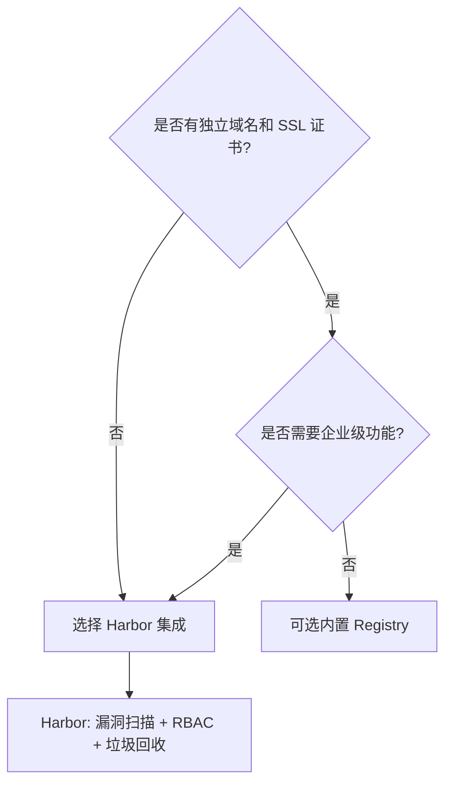
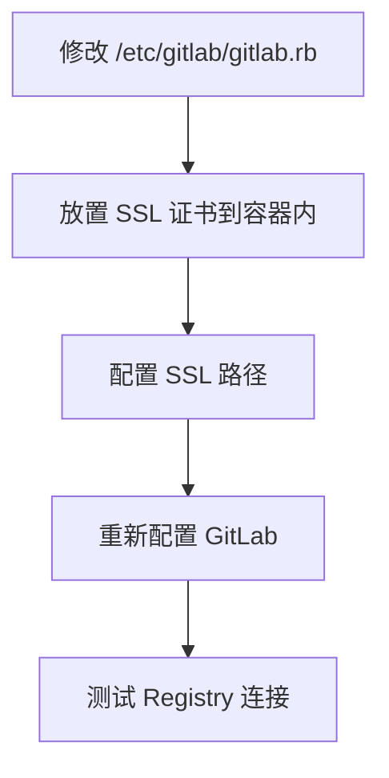
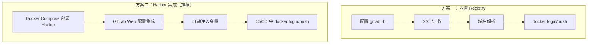

# GitLab 容器镜像仓库管理

## 概述

GitLab 提供两种容器镜像仓库方案：内置 Container Registry 和集成 Harbor。内置方案需要独立域名和 SSL 证书，配置复杂；Harbor 集成方案部署简单、功能丰富，是企业级场景的推荐选择。本文详解两种方案的配置方法，以及在 CI/CD 中推送 Docker 镜像的完整流程。

## 学习目标

- 理解两种镜像仓库方案的架构差异与选型依据
- 掌握内置 Container Registry 的配置流程与常见坑点
- 掌握 GitLab 集成 Harbor 的配置方法
- 实现在 CI/CD Pipeline 中构建并推送 Docker 镜像

---

## 一、方案对比与选型

### 1.1 两种方案概览

| 对比项 | 内置 Container Registry | Harbor 集成 |
|--------|----------------------|-------------|
| 集成度 | 高（GitLab 原生） | 中（需配置集成） |
| 部署难度 | 高（需域名、证书） | 低（Docker Compose） |
| 配置复杂度 | 高（修改 gitlab.rb） | 低（Web 界面） |
| 功能丰富度 | 基础推拉 | 企业级（权限、扫描、签名、回收） |
| 维护成本 | 高 | 低 |
| 推荐程度 | 适合已有域名证书的环境 | 企业首选 |

### 1.2 选型建议



---

## 二、内置 Container Registry

### 2.1 配置要求

| 要求 | 说明 |
|------|------|
| 独立域名 | 如 `registry.example.com`，不能使用 IP |
| SSL 证书 | 必须配置，Docker 客户端强制 HTTPS |
| 存储路径 | 镜像数据的持久化目录 |

### 2.2 配置流程



### 2.3 gitlab.rb 配置

```ruby
# /etc/gitlab/gitlab.rb

# 启用 Registry
registry['enable'] = true

# Registry 外部访问地址
registry_external_url 'https://registry.example.com'

# 对接配置
gitlab_rails['registry_enabled'] = true
registry['registry_http_addr'] = 'localhost:5000'
```

### 2.4 SSL 证书配置

证书必须放在容器内 `/etc/gitlab/ssl/` 目录，且命名必须符合 GitLab 规范：

```bash
# 证书文件命名格式
registry.example.com.crt
registry.example.com.key
```

### 2.5 对接外部 Docker Registry

若使用独立的 Docker Registry 而非 GitLab 内置存储：

```yaml
# Registry config.yml
version: 0.1

http:
  addr: :5000

auth:
  token:
    realm: https://gitlab.example.com/jwt/auth
    service: container_registry
    issuer: gitlab-issuer
    rootcertbundle: /etc/registry/registry.crt
```

Docker Compose 配置：

```yaml
services:
  registry:
    image: registry:2
    ports:
      - "5000:5000"
    volumes:
      - /home/registry/service:/etc/registry
      - /home/registry/data:/var/lib/registry
    environment:
      REGISTRY_AUTH_TOKEN_REALM: https://gitlab.example.com/jwt/auth
      REGISTRY_AUTH_TOKEN_SERVICE: container_registry
      REGISTRY_AUTH_TOKEN_ISSUER: gitlab-issuer
      REGISTRY_AUTH_TOKEN_ROOTCERTBUNDLE: /etc/registry/registry.crt
```

自签名证书生成：

```bash
openssl req -newkey rsa:4096 -nodes -sha256 \
  -keyout /home/registry/service/registry.key \
  -x509 -days 365 \
  -out /home/registry/service/registry.crt \
  -subj "/CN=registry.example.com"
```

### 2.6 常见坑点

| 问题 | 原因 | 解决方案 |
|------|------|---------|
| Registry 无法启动 | 证书未配置或路径错误 | 即使不用 HTTPS 也需配置证书 |
| `root cert bundle not configured` | rootcertbundle 未指定 | 配置自签名证书路径 |
| 证书不生效 | 放在宿主机而非容器内 | 通过 volumes 映射到容器内 |
| 域名解析失败 | 使用 IP 而非域名 | 必须配置可解析的域名 |
| 证书命名错误 | 随意命名 | 必须按 GitLab 指定格式命名 |

### 2.7 使用方式

```bash
# 登录
docker login registry.example.com

# 标记镜像
docker tag myapp registry.example.com/group/project/myapp:latest

# 推送
docker push registry.example.com/group/project/myapp:latest
```

### 2.8 私有与公有仓库

| 项目可见性 | 拉取行为 |
|-----------|---------|
| 私有（Private） | 需先 `docker login`，否则报 `denied` |
| 公开（Public） | 直接 `docker pull`，无需认证 |

设置路径：`项目 → 设置 → 通用 → 可见性、项目功能、权限`

---

## 三、Harbor 集成方案（推荐）

### 3.1 Harbor 优势

- **专业镜像管理**：专注企业级镜像仓库，功能更完善
- **部署简单**：Docker Compose 一键启动
- **集成方便**：GitLab Web 界面配置，自动注入 CI/CD 变量
- **企业级功能**：RBAC 权限、漏洞扫描、镜像签名、垃圾回收、镜像复制

### 3.2 Harbor 安装回顾

```bash
# 下载离线安装包
# 版本以 GitHub Releases 页面为准，截至 2026-09 最新为 v2.15.2
wget https://github.com/goharbor/harbor/releases/download/v2.15.2/harbor-offline-installer-v2.15.2.tgz
tar xvf harbor-offline-installer-v2.15.2.tgz

# 修改配置
cd harbor
cp harbor.yml.tmpl harbor.yml
# 编辑 harbor.yml：修改 hostname、admin 密码

# 安装启动
./install.sh
```

### 3.3 GitLab 集成配置

路径：`项目 → 设置 → 集成 → 搜索 "Harbor"`

| 配置项 | 说明 | 示例 |
|--------|------|------|
| Harbor URL | Harbor 访问地址 | `https://harbor.example.com` |
| Project name | Harbor 项目名称 | `frontend` |
| Username | Harbor 用户名 | `admin` |
| Password | Harbor 密码 | （Harbor 管理员密码） |

### 3.4 集成后自动注入的变量

| 变量名 | 说明 |
|--------|------|
| `HARBOR_URL` | Harbor 地址 |
| `HARBOR_USERNAME` | 用户名 |
| `HARBOR_PASSWORD` | 密码 |
| `HARBOR_PROJECT` | 项目名 |
| `HARBOR_HOST` | Harbor 主机 |
| `HARBOR_OCI` | OCI Registry 端点 |

这些变量可在 `.gitlab-ci.yml` 中直接引用，无需手动配置 CI/CD 变量。

---


## 四、CI/CD 中构建和推送镜像

### 4.1 基础配置

```yaml
# .gitlab-ci.yml

stages:
  - build
  - deploy

build_image:
  stage: build
  image: docker:latest
  services:
    - docker:dind
  before_script:
    - docker login -u $HARBOR_USERNAME -p $HARBOR_PASSWORD $HARBOR_URL
  script:
    - docker build -t $HARBOR_URL/$HARBOR_PROJECT/myapp:$CI_COMMIT_SHORT_SHA .
    - docker push $HARBOR_URL/$HARBOR_PROJECT/myapp:$CI_COMMIT_SHORT_SHA
  rules:
    - if: $CI_COMMIT_BRANCH == "main"
```

### 4.2 镜像标签策略

```yaml
build_image:
  stage: build
  image: docker:latest
  services:
    - docker:dind
  before_script:
    - docker login -u $HARBOR_USERNAME -p $HARBOR_PASSWORD $HARBOR_URL
  script:
    - |
      if [ "$CI_COMMIT_BRANCH" = "$CI_DEFAULT_BRANCH" ]; then
        IMAGE_TAG="latest"
      else
        IMAGE_TAG="$CI_COMMIT_REF_SLUG"
      fi
    - docker build -t $HARBOR_URL/$HARBOR_PROJECT/myapp:$IMAGE_TAG .
    - docker push $HARBOR_URL/$HARBOR_PROJECT/myapp:$IMAGE_TAG
    # 主分支同时打 commit SHA 标签
    - |
      if [ "$CI_COMMIT_BRANCH" = "$CI_DEFAULT_BRANCH" ]; then
        docker tag $HARBOR_URL/$HARBOR_PROJECT/myapp:latest \
          $HARBOR_URL/$HARBOR_PROJECT/myapp:$CI_COMMIT_SHORT_SHA
        docker push $HARBOR_URL/$HARBOR_PROJECT/myapp:$CI_COMMIT_SHORT_SHA
      fi
```

标签策略说明：

| 分支 | 标签 | 用途 |
|------|------|------|
| main | `latest` + `commit SHA` | 生产环境，可回滚 |
| develop | `develop` | 测试环境 |
| feature/* | `feature-xxx` | 预览环境 |

### 4.3 Docker-in-Docker 说明

| 关键字 | 作用 |
|--------|------|
| `image: docker:latest` | Job 运行在 Docker CLI 容器中 |
| `services: [docker:dind]` | 启动 Docker Daemon 作为服务容器 |

这是 GitLab CI 中构建 Docker 镜像的标准模式（DinD），Runner 的执行器必须是 Docker 类型且开启 `privileged` 模式。

---

## 五、方案总结



| 决策因素 | 内置 Registry | Harbor |
|---------|-------------|--------|
| 已有域名证书 | 可选 | 推荐 |
| 无域名证书 | 不可行 | 推荐 |
| 需要漏洞扫描 | 不支持 | 支持 |
| 需要细粒度权限 | 继承 GitLab 权限 | RBAC + 项目级 |
| 多团队协作 | 一般 | 优秀 |

---

## 常见问题

**Q: 使用 Harbor 集成后，还需要在 CI/CD 变量中配置 Harbor 密码吗？**

不需要。GitLab 集成 Harbor 后会自动注入 `HARBOR_URL`、`HARBOR_USERNAME`、`HARBOR_PASSWORD`、`HARBOR_PROJECT`、`HARBOR_HOST`、`HARBOR_OCI` 变量，直接在 `.gitlab-ci.yml` 中引用即可。

**Q: docker:dind 服务启动失败怎么办？**

确认 Runner 配置中 `privileged = true`（config.toml 的 `[runners.docker]` 段）。DinD 模式需要特权容器才能运行 Docker Daemon。

**Q: 内置 Registry 和 Harbor 可以同时使用吗？**

可以，但不建议。同时使用会增加管理复杂度。建议统一使用一种方案，企业环境优先选择 Harbor。

---

## 延伸阅读

- 官方文档：[GitLab Container Registry](https://docs.gitlab.com/ee/user/packages/container_registry/)

