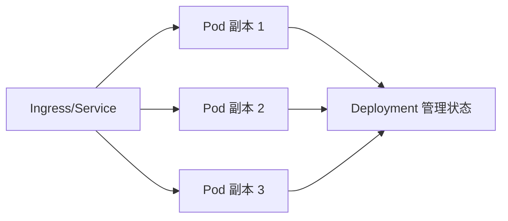
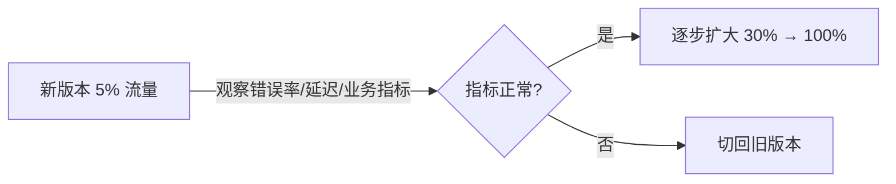

# Kubernetes 与灰度发布

## 0. 引言

当项目从"能部署"走向"稳定发布"，核心问题就从单机部署转向：服务如何调度与扩缩容？配置与密钥如何管理？新版本如何逐步放量？失败如何快速止损？**Kubernetes 与灰度发布正是解决这些问题的常见组合**。本章先梳理 Kubernetes 在发布链路中的核心角色，再对比滚动、灰度、蓝绿三种发布策略，给出可落地的灰度发布实施路径。

---

## 1. Kubernetes 的核心角色

| 对象 | 职责 | 说明 |
|------|------|------|
| Pod | 最小部署单元 | Java 应用以 Pod 运行，可含主容器与 sidecar |
| Deployment | 声明式管理副本 | 负责副本数、滚动更新与回滚 |
| Service | 稳定访问入口 | 把流量转发到后端 Pod，屏蔽 Pod IP 漂移 |
| ConfigMap / Secret | 配置管理 | 普通配置与敏感配置分离，不硬编码进镜像 |

**核心原则**：环境差异（配置、密钥）必须通过 ConfigMap/Secret 注入，而不是写死在镜像里——这是容器化与不可变基础设施的前提。

---

## 2. Java 项目在 Kubernetes 上的关注点

- **JVM 参数与容器资源匹配**：`-XX:MaxRAMPercentage` 按容器限额分配堆，避免 OOM 与资源浪费；
- **探针配置合理**：Readiness（就绪，决定是否接流量）与 Liveness（存活，决定是否重启）分开配置；
- **日志走标准输出**：应用日志输出到 stdout，由平台统一采集，避免本地文件日志随 Pod 消失；
- **启动慢的服务**：就绪探针设置合理 initialDelay，防止启动期间被剔除流量。

---

## 3. 三种发布策略对比

| 策略 | 机制 | 优点 | 成本与风险 |
|------|------|------|------------|
| 滚动发布 | 一批一批替换旧实例 | 成本低、无需额外环境 | 新版本故障会影响部分用户 |
| 灰度发布 | 少量真实流量先进新版本 | 真实流量验证、风险可控 | 需要流量切分能力 |
| 蓝绿发布 | 新旧两套环境并存 | 切流简单、回滚最快 | 资源成本翻倍 |

- **滚动发布**：适合变更风险较低的常规版本；
- **灰度发布**：解决的不是"怎么发版"，而是"**怎么降低发版风险**"；
- **蓝绿发布**：适合重大变更或对回滚速度要求极高的场景。

---

## 4. 灰度发布的基本思路

1. 发布新版本实例（新 Deployment/新版本镜像）；
2. 只给新版本 **5%~10%** 的流量；
3. 观察**日志、错误率、响应时间与核心业务指标**；
4. 指标正常 → 逐步扩大流量（30% → 50% → 100%）；
5. 异常 → **立刻切回旧版本**。

流量切分手段：K8s Service 多版本 + 权重调整、Ingress 按 Header/Cookie 分流（金丝雀）、服务网格（Istio）精细化路由。

---

## 5. 常见误区

- **有 K8s 就默认高可用**：忽略探针与资源限制，故障时并不能自愈；
- **灰度只看接口成功率**：业务指标（转化率、订单量）才是灰度决策的核心依据；
- **发布前没有回滚方案**：出问题时手工现查，错过止损窗口；
- **配置与代码一起灰度**：不区分风险来源，配置变更失败难以定位。

---

## 6. 小结

- **K8s 角色**：Pod 部署、Deployment 管理、Service 接入、ConfigMap/Secret 解耦配置；
- **Java 适配**：JVM 限额参数、双探针、stdout 日志是容器化三件套；
- **策略选型**：常规用滚动、控风险用灰度、快速回滚用蓝绿，成本与风险权衡；
- **灰度五步**：发布新实例 → 5%~10% 流量 → 观察指标 → 逐步放量 → 异常切回；
- **核心思维**：灰度发布是"用真实流量做验证"的风险控制手段，业务指标才是决策依据。

下一章深入 Kubernetes 灰度发布与滚动发布的实现细节——零宕机发布的完整机制。

> 📖 **相关理论延伸**：部署策略的理论体系（蓝绿 / 金丝雀 / 渐进式交付的概念区分与选型依据）见《持续交付36讲》[部署策略：蓝绿、金丝雀、渐进式交付](../02-持续交付36讲/16-部署策略：蓝绿、金丝雀、渐进式交付.md)。