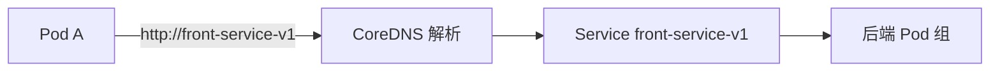

# Kubernetes DNS 策略：将你的服务连接起来

## 0. 引言

单体应用部署完成后，下一个问题扑面而来：**A 服务如何找到 B 服务？** Nginx 要转发到别的服务、后端要连接 MySQL，而 Pod 的 IP 是漂移的、端口也不固定——靠写死 IP 连接，一次扩缩容就全线崩溃。解法是**服务发现**：Kubernetes 用 CoreDNS 为每个 Service 注册内部域名，让服务之间像访问网站一样"用名字访问"。本章讲透 K8s 的服务发现原理与两种 DNS 解析规则。

---

## 1. 服务发现：从 DNS 说起

服务发现指使用注册中心记录分布式系统中全部服务的信息，让其他服务快速找到已注册服务。其实我们每天都在用服务发现：

> 通过域名访问网站时，浏览器先把域名发送给 DNS 服务器，拿到 IP 后再访问真实服务器——**DNS 将域名映射为真实 IP 的过程，就是一次服务发现**。我们不必记住每个网站的 IP，只需记住永不变的域名。

Kubernetes 中同理：Pod IP 漂移且不固定，就用 **Service** 固定访问入口；而 Service 自身的 IP 也不确定，于是利用 DNS 机制给每个 Service 加一个**内部域名**，指向其真实 IP。



---

## 2. CoreDNS 组件

CoreDNS 是 Go 语言实现的 DNS 服务器，支持插件化扩展，不仅用于 Kubernetes，也可作日常 DNS 服务器使用。**Kubernetes 1.11 之后默认内置 CoreDNS**。

验证安装情况：

```bash
kubectl -n kube-system get all -l k8s-app=kube-dns -o wide
```

---

## 3. 服务发现规则

### 3.1 进入容器验证

```bash
kubectl get pods      # 查看运行中的 Pod
kubectl get svc       # 查看 Service（如 front-service-v1 / front-service-v2）
kubectl exec -it front-v1-787bf5c86d-t78x5 -- /bin/sh
```

`kubectl exec` 直接在容器内执行命令：`-i` 保持标准输入打开，`-t` 分配伪终端（TTY），两者常连用。

### 3.2 同 namespace：直接访问

服务创建时未指定 namespace 时，都在默认的 `default` 命名空间下。同 namespace 内**直接用 ServiceName 访问**：

```bash
wget -q -O- http://front-service-v1
# 或
curl http://front-service-v1
```

### 3.3 跨 namespace：完整域名

跨 namespace 的访问规则（同 namespace 也适用）：

```
[ServiceName].[Namespace].svc.cluster.local
```

- `ServiceName`：Service 名称；
- `Namespace`：目标命名空间（未指定则为 `default`）；
- `svc.cluster.local`：集群 DNS 域后缀。

```bash
curl http://front-service-v1.default.svc.cluster.local
```

| 场景 | 访问方式 | 示例 |
|------|----------|------|
| 同 namespace | `http://ServiceName:Port` | `http://front-service-v1` |
| 跨 namespace | `http://ServiceName.Namespace.svc.cluster.local` | `http://front-service-v1.default.svc.cluster.local` |

> namespace（命名空间）是 K8s 的重要概念：集群默认创建 `default`，不同命名空间实现资源、服务乃至权限隔离。

---

## 4. 小结

- **服务发现本质**：DNS 把"名字"映射为"IP"，K8s 用同样机制解决 Pod IP 漂移问题；
- **CoreDNS**：K8s 内置 DNS 服务器，为每个 Service 注册内部域名；
- **两条规则**：同 namespace 用 ServiceName 直连；跨 namespace 补全 `ServiceName.Namespace.svc.cluster.local`；
- **验证手法**：`kubectl exec` 进容器，用 `curl`/`wget` 实测服务名访问——这是排查服务间连通性的第一动作。

下一章讲解 Kubernetes ConfigMap——如何把环境变量与配置从镜像中抽离出来统一管理。