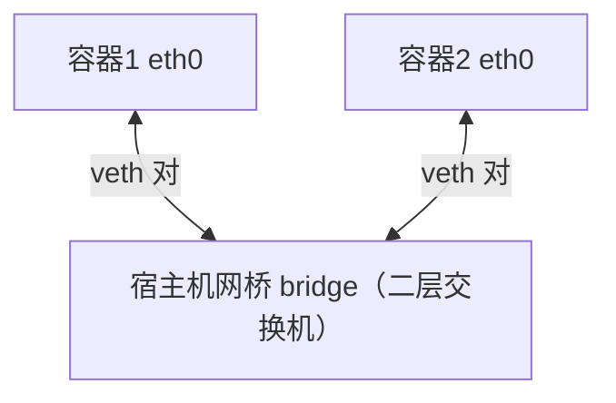
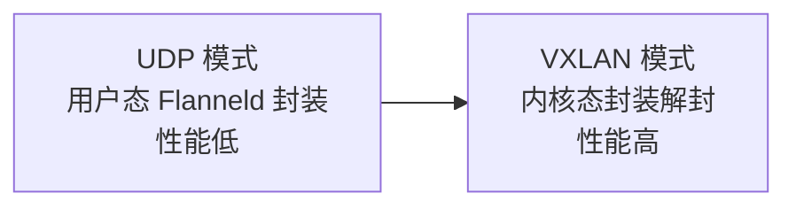

# K8s 主流网络方案（OVS、Flannel、Calico）及原理

## 0. 引言

K8s 是容器编排工具，理解它的网络，本质是理解**容器间的网络互访原理**。容器通过 namespace 做网络隔离，每个容器拥有独立的网卡、回环设备与端口。本章从通信原理出发：先讲同宿主机与跨宿主机的两种通信机制（隧道封装 vs 路由），再剖析 K8s 的 CNI 插件体系，最后对比 Flannel（UDP/VXLAN）与 Calico（BGP/IPIP）两大主流方案。

---

## 1. 容器间通信原理

### 1.1 同宿主机：网桥串联

同一宿主机的两个容器（如 Docker01/Docker02）各有自己的网卡 eth0，宿主侧对应一对虚拟网卡 **Veth**。所有 Veth 接入宿主机上的**网桥**（bridge）——相当于二层虚拟交换机，让同宿主机容器互联互通。

### 1.2 跨宿主机：隧道封装 vs 路由

跨宿主机的容器通信有两种方案：

| 方案 | 原理 | 优点 | 缺点 |
|------|------|------|------|
| 隧道封装 | 在容器内层包上封装一层虚拟包头（VXLAN/GRE） | 不依赖二层网络，通用 | 封装/解封有性能损耗 |
| 路由 | 修改路由表控制下一跳 IP | 性能好 | 需解决动态路由问题，实现复杂 |

**隧道方案**：容器 A 的包从 C 端封包（加上外层 C→D 的 IP/MAC 包头），经宿主机网络传到 D 后解包，容器 B 看到的是原始 IP/MAC——数据包借助宿主机网络"搭车"完成跨机通信。

**路由方案**：在宿主机 C 上添加路由——目标为 B 的 IP 网段时，下一跳指向宿主机 D（如 192.168.0.2），A 的包直接经路由转发到 D 再交给容器 B。

---

## 2. CNI 插件机制

K8s 通过 **CNI（Container Network Interface）** 插件规范容器网络，提供三类核心能力：

- 创建 Pod 时分配网络接口地址；
- 提供 Pod 间相互通信；
- 删除 Pod 时释放网络资源。

常见 CNI 插件：Flannel、Canal、Calico 等，它们各自实现"同节点桥接 + 跨节点连通"的完整方案。

---

## 3. Flannel：隧道方案代表

### 3.1 UDP 模式

每台宿主机运行 Flanneld 进程，通过查询 etcd 获取"子网 ↔ 宿主机"对应关系；数据平面有 flannel1 网卡。发送流程：容器 A 的包经 veth 到网桥 → Flanneld（用户态）封装目标物理机 IP 与监听端口 → 经 flannel1/eth0 发出。

**致命短板**：UDP 封装在用户态完成，涉及用户态↔内核态数据拷贝，性能损耗大。

### 3.2 VXLAN 模式

同样是报文封装，但封装/解封**完全交给 Linux 内核实现**，不再经过用户态，性能显著提升——这是 Flannel 生产环境的推荐模式。

---

## 4. Calico：路由方案代表

Flannel 系基于报文封装，要追求最高性能需走**路由模式**——Calico 正是这套机制的实现。

### 4.1 BGP 模式

动态路由是路由模式的核心难题，Calico 用两个组件解决：

| 组件 | 职责 |
|------|------|
| BGP Speaker | 路由广播，交换各节点容器网段信息 |
| Felix | 路由配置，维护主机路由与策略 |

由于**不封装/解封数据包**，性能最优；但路由模式受制于二层网络条件（BGP 需要节点二层可达）。

### 4.2 IPIP 模式

结合路由协议与底层封装：通过 tun0 网卡把不同主机用隧道打通，**既保留路由性能，又突破二层网络限制**——适合跨网段/跨机房的大规模集群。

### 4.3 选型一览

| 插件/模式 | 机制 | 性能 | 适用 |
|-----------|------|------|------|
| Flannel UDP | 用户态封装 | 低 | 学习演示 |
| Flannel VXLAN | 内核态封装 | 中 | 中小集群默认 |
| Calico BGP | 纯路由 | 高 | 二层可达的同网段集群 |
| Calico IPIP | 路由+封装 | 高 | 跨网段大规模集群 |

---

## 5. 小结

- **通信原理**：同宿主机靠网桥+veth，跨宿主机靠"隧道封装"或"路由"二选一；
- **CNI 定位**：K8s 网络插件标准，负责地址分配、Pod 互通与资源释放；
- **Flannel**：隧道方案，UDP 用户态封装性能差，VXLAN 内核态封装是生产默认；
- **Calico**：路由方案，BGP 性能最优但受二层限制，IPIP 模式突破限制兼顾性能；
- **选型逻辑**：集群规模、网段拓扑与性能要求共同决定，小集群 Flannel 够用，大规模/强隔离选 Calico。

下一章讲解基于 K8s 架构打造 CICD 平台的核心思路——镜像、编排与发布流水线的完整闭环。