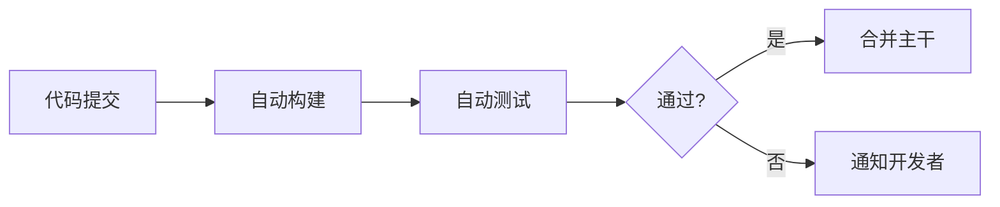
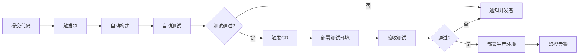

# 前端自动化与 CI/CD 概念

## 概述

前端自动化是指前端代码的自动化构建、打包、测试及部署流程的统称。CI/CD（持续集成/持续交付）是其核心实践，通过自动化工具链将代码从提交到上线的全流程标准化。

## 学习目标

1. 理解前端自动化的四个核心环节
2. 区分 CI（持续集成）与 CD（持续交付/持续部署）
3. 了解主流 CI/CD 工具及选型建议

---

## 一、前端自动化核心流程

| 环节 | 说明 | 常用工具 |
|------|------|---------|
| 构建 | 将源代码转换为可执行代码 | Webpack、Vite、Rollup |
| 打包 | 压缩、优化、生成最终产物 | Webpack、Vite、esbuild |
| 测试 | 自动化运行单元测试、E2E 测试 | Jest、Vitest、Cypress |
| 部署 | 将代码发布到服务器/生产环境 | Jenkins、GitHub Actions、GitLab CI |

### 自动化 vs 手动化

| 维度 | 手动化 | 自动化 |
|------|--------|--------|
| 操作方式 | 手动执行 CLI 命令 | 工具自动执行脚本 |
| 效率 | 低，需要人工介入 | 高，无需人工干预 |
| 出错率 | 高，容易遗漏步骤 | 低，流程标准化 |
| 可追溯性 | 难以记录 | 完整日志记录 |

---

## 二、CI/CD 核心概念

### CI：持续集成（Continuous Integration）

开发人员频繁地将代码集成到主干分支，每次集成通过自动化构建和测试验证，尽早发现集成错误。

关键要点：
- 频繁提交：每天至少提交一次代码
- 自动化构建：每次提交触发构建
- 自动化测试：构建后运行测试套件
- 快速反馈：失败立即通知

### CD：持续交付 vs 持续部署

| 类型 | 英文 | 生产部署方式 |
|------|------|------------|
| 持续交付 | Continuous Delivery | 代码随时可部署，需手动触发 |
| 持续部署 | Continuous Deployment | 代码自动部署到生产环境 |

### CI/CD 完整流程

---

## 三、前端工程化 vs 前端自动化

| 维度 | 前端工程化 | 前端自动化 |
|------|-----------|-----------|
| 范围 | 构建和打包环节 | 完整的构建→部署流程 |
| 工具 | Webpack、Vite | Jenkins、GitHub Actions |
| 包含测试 | 需手动执行 | 自动运行 |
| 包含部署 | 需手动部署 | 自动部署 |

前端工程化是前端自动化的一个子集，自动化涵盖更完整的流程。

---

## 四、主流 CI/CD 工具对比

| 工具 | 类型 | 特点 | 适用场景 |
|------|------|------|---------|
| Jenkins | 自托管 | 插件丰富（2000+）、高度可定制 | 企业内部、定制需求高 |
| GitHub Actions | 云托管 | 与 GitHub 深度集成 | 开源项目、GitHub 用户 |
| GitLab CI/CD | 自托管/云托管 | 与 GitLab 集成 | 使用 GitLab 的团队 |
| CircleCI | 云托管 | 配置简单、速度快 | 中小型团队 |

选型建议：
- 小型团队/开源项目 → GitHub Actions
- 中型团队 → GitLab CI / CircleCI
- 大型企业/定制需求 → Jenkins

---

## 常见问题

| 问题 | 解答 |
|------|------|
| CI 和 CD 有什么区别？ | CI 关注代码集成和测试，CD 关注代码部署和交付 |
| 持续交付和持续部署的区别？ | 持续交付需手动触发部署，持续部署完全自动化 |
| 前端工程化和自动化什么关系？ | 工程化是自动化的子集 |
| 为什么选择 Jenkins？ | 本地搭建成本低、插件生态丰富、企业应用广泛 |

---

## 延伸阅读

- [Jenkins 官方文档](https://www.jenkins.io/doc/)
- [GitHub Actions 文档](https://docs.github.com/en/actions)
- [GitLab CI/CD 文档](https://docs.gitlab.com/ee/ci/)
- 《持续交付：发布可靠软件的系统方法》
- 《DevOps 实践指南》

> 📖 **相关理论延伸**：CI/CD 的核心概念、流水线设计与部署/回滚的完整理论体系，见 [CI/CD](../01-持续交付与CI-CD/00-CI-CD.md)；GitHub Actions / GitLab CI 的对比选型见 [GitHub Actions 与 GitLab CI 对比](../01-持续交付与CI-CD/03-GitHub%20Actions%20与%20GitLab%20CI%20对比.md)。

---

